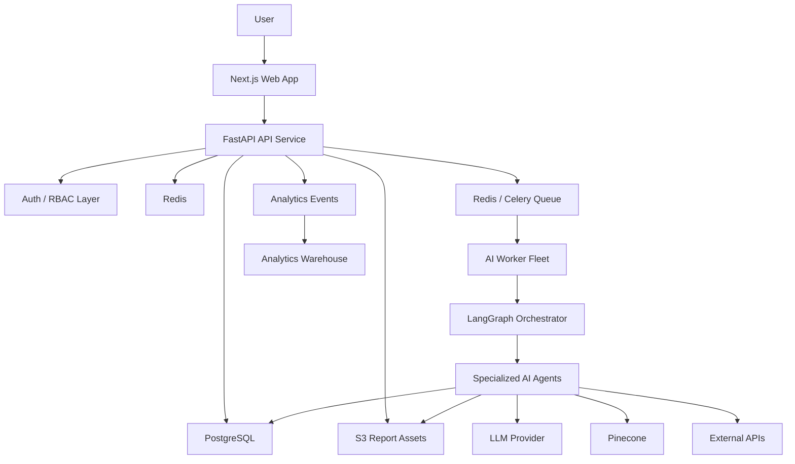
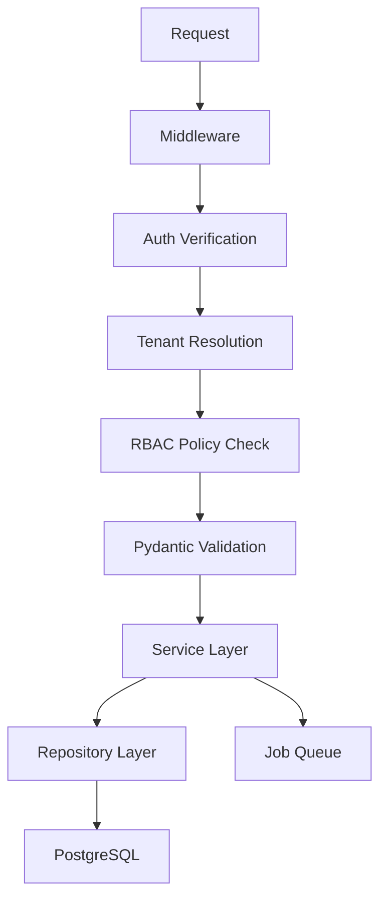
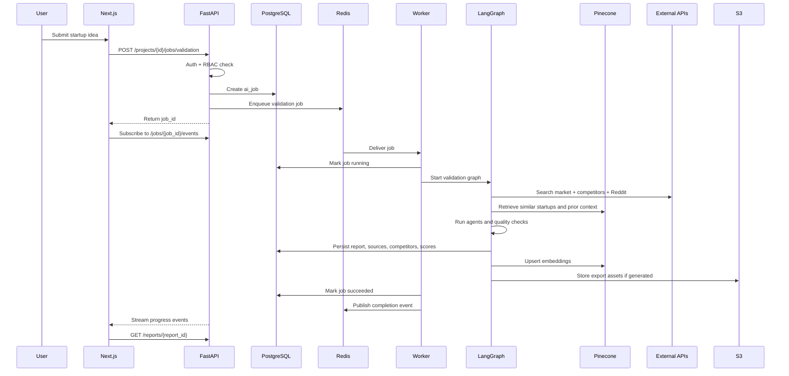
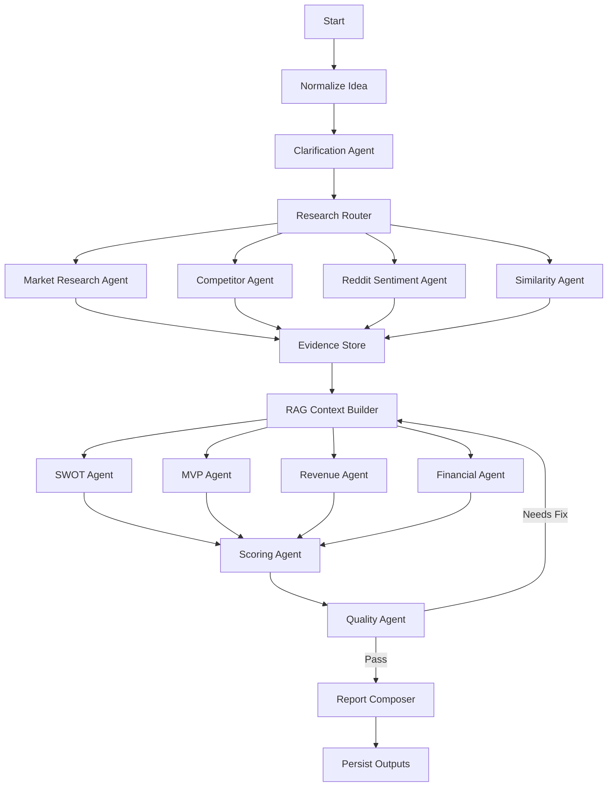
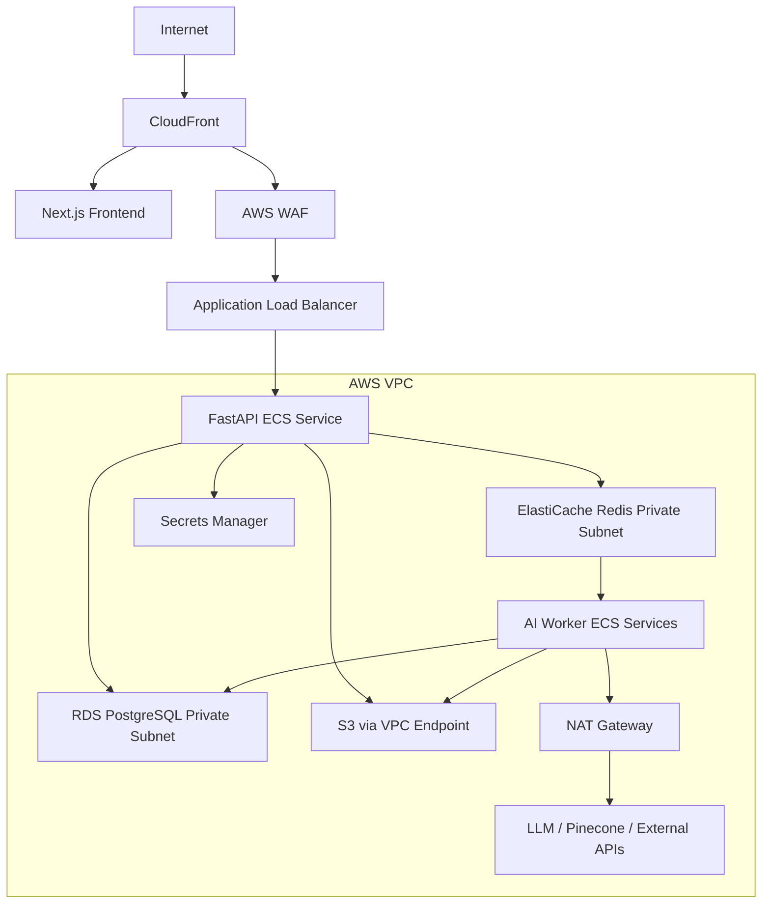

# AI Startup Copilot: Production Architecture

## 1. High-Level Architecture

AI Startup Copilot is a multi-tenant AI SaaS platform built around a Next.js frontend, FastAPI backend, PostgreSQL system of record, Redis cache and queue layer, Pinecone vector database, LangGraph multi-agent workflows, and AWS-managed infrastructure.

The architecture separates synchronous product APIs from long-running AI research and generation workflows. User-facing requests are handled by the API service, while validation reports, competitor research, Reddit analysis, pitch deck generation, and financial projections run as background jobs through a worker fleet.

### Core Principles

- Keep user-facing APIs fast and predictable.
- Run AI workflows asynchronously with resumable job state.
- Store structured business artifacts in PostgreSQL.
- Store embeddings and retrieval metadata in Pinecone.
- Use Redis for caching, rate limits, locks, queues, and job progress.
- Use LangGraph for deterministic multi-agent orchestration.
- Keep external API access behind provider adapters.
- Enforce tenant isolation across every API, job, and retrieval path.
- Track cost, latency, quality, and source coverage for every AI run.

### Logical Architecture



## 2. Component Diagram

### Frontend: Next.js + TypeScript

Responsibilities:

- Authentication flows
- Workspace and project dashboards
- Startup idea intake
- AI job status and progress UI
- Report viewer and editor
- Pitch deck preview and export
- Analytics instrumentation
- Role-aware UI permissions

Recommended implementation:

- Next.js App Router
- TypeScript
- Server components for authenticated dashboard shells
- Client components for report editors, progress streams, deck editing, and charts
- TanStack Query or SWR for API state
- Zod for client-side validation
- Segment, PostHog, or RudderStack for product analytics

### Backend: FastAPI

Responsibilities:

- REST API
- Auth verification
- RBAC enforcement
- Organization and project management
- Report CRUD
- Job creation and status APIs
- Webhook handling
- External integration token management
- Audit logging
- API rate limiting

Recommended implementation:

- FastAPI with Pydantic v2 schemas
- SQLAlchemy 2.x or SQLModel
- Alembic migrations
- Dependency-injected tenant context
- OpenAPI-generated TypeScript client
- Structured logging with request IDs

### Background Workers

Responsibilities:

- Execute LangGraph workflows
- Call external APIs
- Generate embeddings
- Perform RAG retrieval
- Generate reports, decks, and financial models
- Store outputs
- Emit job progress events
- Record AI cost and quality metrics

Recommended implementation:

- Celery with Redis broker, or Temporal for stronger workflow durability
- Separate worker pools by workload type:
  - `research-workers`
  - `generation-workers`
  - `embedding-workers`
  - `export-workers`
  - `analytics-workers`

### Data Stores

| Store | Purpose |
| --- | --- |
| PostgreSQL | Source of truth for users, organizations, projects, reports, jobs, permissions, billing metadata |
| Redis | Cache, rate limits, job progress, queue broker, distributed locks |
| Pinecone | Semantic search over reports, competitors, sources, startup ideas, personas, Reddit insights |
| S3 | Generated PDFs, PPTX files, report exports, source snapshots where allowed |
| Analytics Warehouse | Product events, usage metrics, funnel analysis, AI cost analytics |

### External Integrations

| Integration | Use Case |
| --- | --- |
| LLM Provider | Reasoning, generation, classification, extraction |
| Search API | Web research and competitor discovery |
| Reddit API | Subreddit discovery, posts, comments, sentiment inputs |
| Crunchbase / Similar | Funding and company metadata, if licensed |
| Stripe | Billing, subscriptions, usage credits |
| Auth Provider | OAuth, enterprise SSO, MFA |
| Email Provider | Invites, report completion notifications |
| Analytics Provider | Product behavior tracking |

## 3. Database Design

PostgreSQL is the system of record. All tables include `created_at`, `updated_at`, and where relevant `deleted_at` for soft deletion.

### Multi-Tenancy Model

- Every business object belongs to an `organization_id`.
- Every API request resolves a tenant context before accessing data.
- Row-level security can be enabled for additional defense in depth.
- Background jobs must carry `organization_id`, `project_id`, `user_id`, and permission snapshot metadata.

### Core Tables

```sql
CREATE TABLE users (
  id UUID PRIMARY KEY,
  email TEXT UNIQUE NOT NULL,
  full_name TEXT,
  avatar_url TEXT,
  auth_provider TEXT NOT NULL,
  auth_subject TEXT UNIQUE NOT NULL,
  last_login_at TIMESTAMPTZ,
  created_at TIMESTAMPTZ NOT NULL,
  updated_at TIMESTAMPTZ NOT NULL
);

CREATE TABLE organizations (
  id UUID PRIMARY KEY,
  name TEXT NOT NULL,
  slug TEXT UNIQUE NOT NULL,
  plan TEXT NOT NULL,
  billing_customer_id TEXT,
  created_at TIMESTAMPTZ NOT NULL,
  updated_at TIMESTAMPTZ NOT NULL
);

CREATE TABLE organization_memberships (
  id UUID PRIMARY KEY,
  organization_id UUID NOT NULL REFERENCES organizations(id),
  user_id UUID NOT NULL REFERENCES users(id),
  role TEXT NOT NULL CHECK (role IN ('owner', 'admin', 'editor', 'viewer')),
  status TEXT NOT NULL CHECK (status IN ('active', 'invited', 'disabled')),
  created_at TIMESTAMPTZ NOT NULL,
  updated_at TIMESTAMPTZ NOT NULL,
  UNIQUE (organization_id, user_id)
);

CREATE TABLE startup_projects (
  id UUID PRIMARY KEY,
  organization_id UUID NOT NULL REFERENCES organizations(id),
  created_by UUID NOT NULL REFERENCES users(id),
  name TEXT NOT NULL,
  idea_description TEXT NOT NULL,
  industry TEXT,
  target_customer TEXT,
  geography TEXT,
  stage TEXT,
  status TEXT NOT NULL CHECK (status IN ('draft', 'active', 'archived')),
  metadata JSONB NOT NULL DEFAULT '{}',
  created_at TIMESTAMPTZ NOT NULL,
  updated_at TIMESTAMPTZ NOT NULL
);

CREATE TABLE project_assumptions (
  id UUID PRIMARY KEY,
  organization_id UUID NOT NULL REFERENCES organizations(id),
  project_id UUID NOT NULL REFERENCES startup_projects(id),
  assumption_type TEXT NOT NULL,
  content TEXT NOT NULL,
  confidence_score NUMERIC(5,2),
  validation_status TEXT NOT NULL DEFAULT 'untested',
  created_at TIMESTAMPTZ NOT NULL,
  updated_at TIMESTAMPTZ NOT NULL
);

CREATE TABLE ai_jobs (
  id UUID PRIMARY KEY,
  organization_id UUID NOT NULL REFERENCES organizations(id),
  project_id UUID REFERENCES startup_projects(id),
  requested_by UUID NOT NULL REFERENCES users(id),
  job_type TEXT NOT NULL,
  status TEXT NOT NULL CHECK (status IN ('queued', 'running', 'succeeded', 'failed', 'cancelled')),
  priority INTEGER NOT NULL DEFAULT 100,
  input JSONB NOT NULL DEFAULT '{}',
  output JSONB NOT NULL DEFAULT '{}',
  error_code TEXT,
  error_message TEXT,
  progress_percentage INTEGER NOT NULL DEFAULT 0,
  started_at TIMESTAMPTZ,
  completed_at TIMESTAMPTZ,
  created_at TIMESTAMPTZ NOT NULL,
  updated_at TIMESTAMPTZ NOT NULL
);

CREATE TABLE reports (
  id UUID PRIMARY KEY,
  organization_id UUID NOT NULL REFERENCES organizations(id),
  project_id UUID NOT NULL REFERENCES startup_projects(id),
  job_id UUID REFERENCES ai_jobs(id),
  report_type TEXT NOT NULL,
  title TEXT NOT NULL,
  status TEXT NOT NULL CHECK (status IN ('draft', 'generating', 'ready', 'failed')),
  content JSONB NOT NULL DEFAULT '{}',
  summary TEXT,
  score NUMERIC(5,2),
  confidence_score NUMERIC(5,2),
  version INTEGER NOT NULL DEFAULT 1,
  created_at TIMESTAMPTZ NOT NULL,
  updated_at TIMESTAMPTZ NOT NULL
);

CREATE TABLE report_sources (
  id UUID PRIMARY KEY,
  organization_id UUID NOT NULL REFERENCES organizations(id),
  report_id UUID NOT NULL REFERENCES reports(id),
  source_type TEXT NOT NULL,
  title TEXT,
  url TEXT,
  publisher TEXT,
  retrieved_at TIMESTAMPTZ NOT NULL,
  published_at TIMESTAMPTZ,
  relevance_score NUMERIC(5,2),
  metadata JSONB NOT NULL DEFAULT '{}'
);

CREATE TABLE competitors (
  id UUID PRIMARY KEY,
  organization_id UUID NOT NULL REFERENCES organizations(id),
  project_id UUID NOT NULL REFERENCES startup_projects(id),
  name TEXT NOT NULL,
  website TEXT,
  competitor_type TEXT NOT NULL,
  positioning TEXT,
  pricing_summary TEXT,
  feature_summary TEXT,
  funding_summary TEXT,
  similarity_score NUMERIC(5,2),
  metadata JSONB NOT NULL DEFAULT '{}',
  created_at TIMESTAMPTZ NOT NULL,
  updated_at TIMESTAMPTZ NOT NULL
);

CREATE TABLE generated_assets (
  id UUID PRIMARY KEY,
  organization_id UUID NOT NULL REFERENCES organizations(id),
  project_id UUID REFERENCES startup_projects(id),
  report_id UUID REFERENCES reports(id),
  asset_type TEXT NOT NULL,
  file_name TEXT NOT NULL,
  s3_key TEXT NOT NULL,
  content_type TEXT NOT NULL,
  size_bytes BIGINT,
  created_by UUID REFERENCES users(id),
  created_at TIMESTAMPTZ NOT NULL
);

CREATE TABLE audit_logs (
  id UUID PRIMARY KEY,
  organization_id UUID REFERENCES organizations(id),
  user_id UUID REFERENCES users(id),
  action TEXT NOT NULL,
  resource_type TEXT NOT NULL,
  resource_id UUID,
  ip_address INET,
  user_agent TEXT,
  metadata JSONB NOT NULL DEFAULT '{}',
  created_at TIMESTAMPTZ NOT NULL
);

CREATE TABLE usage_events (
  id UUID PRIMARY KEY,
  organization_id UUID NOT NULL REFERENCES organizations(id),
  user_id UUID REFERENCES users(id),
  project_id UUID REFERENCES startup_projects(id),
  event_name TEXT NOT NULL,
  event_properties JSONB NOT NULL DEFAULT '{}',
  created_at TIMESTAMPTZ NOT NULL
);

CREATE TABLE ai_usage_records (
  id UUID PRIMARY KEY,
  organization_id UUID NOT NULL REFERENCES organizations(id),
  job_id UUID REFERENCES ai_jobs(id),
  model_name TEXT NOT NULL,
  input_tokens INTEGER NOT NULL DEFAULT 0,
  output_tokens INTEGER NOT NULL DEFAULT 0,
  estimated_cost_usd NUMERIC(10,4) NOT NULL DEFAULT 0,
  latency_ms INTEGER,
  created_at TIMESTAMPTZ NOT NULL
);
```

### Pinecone Indexes

Use separate namespaces per organization to enforce tenant isolation.

| Index | Namespace | Metadata |
| --- | --- | --- |
| `startup-ideas` | `org_{organization_id}` | `project_id`, `industry`, `geography`, `stage` |
| `report-sections` | `org_{organization_id}` | `project_id`, `report_id`, `report_type`, `section` |
| `competitors` | `org_{organization_id}` | `project_id`, `company_name`, `competitor_type`, `url` |
| `external-sources` | `org_{organization_id}` | `source_type`, `url`, `retrieved_at`, `publisher` |
| `reddit-insights` | `org_{organization_id}` | `subreddit`, `topic`, `sentiment`, `retrieved_at` |

## 4. API Architecture

### API Style

- REST APIs for core SaaS operations.
- Server-sent events or WebSockets for job progress.
- Internal worker APIs through queues, not public HTTP.
- OpenAPI schema generated from FastAPI and consumed by the Next.js client.

### API Layers



### Representative Endpoints

```http
POST   /api/v1/projects
GET    /api/v1/projects
GET    /api/v1/projects/{project_id}
PATCH  /api/v1/projects/{project_id}
DELETE /api/v1/projects/{project_id}

POST   /api/v1/projects/{project_id}/jobs/validation
POST   /api/v1/projects/{project_id}/jobs/competitor-analysis
POST   /api/v1/projects/{project_id}/jobs/market-research
POST   /api/v1/projects/{project_id}/jobs/reddit-sentiment
POST   /api/v1/projects/{project_id}/jobs/pitch-deck

GET    /api/v1/jobs/{job_id}
GET    /api/v1/jobs/{job_id}/events
POST   /api/v1/jobs/{job_id}/cancel

GET    /api/v1/projects/{project_id}/reports
GET    /api/v1/reports/{report_id}
PATCH  /api/v1/reports/{report_id}
POST   /api/v1/reports/{report_id}/export

GET    /api/v1/analytics/workspace
GET    /api/v1/analytics/usage
GET    /api/v1/admin/ai-costs
```

### Authentication

Recommended approach:

- Use Cognito, Auth0, Clerk, or another managed auth provider.
- Frontend obtains JWT.
- FastAPI validates JWT signature and claims.
- Backend maps `auth_subject` to internal `users.id`.
- Every request resolves `organization_id` from route, header, or active workspace.

### RBAC

Roles:

| Role | Permissions |
| --- | --- |
| Owner | Full workspace, billing, members, deletion |
| Admin | Manage projects, reports, members except owner transfer and billing deletion |
| Editor | Create and edit projects, run AI jobs, export reports |
| Viewer | Read reports and project data only |

Policy checks should be centralized:

```text
can(user, action, resource, organization_id)
```

Examples:

- `project:create`
- `project:update`
- `report:generate`
- `report:export`
- `member:invite`
- `billing:manage`
- `analytics:view`

## 5. Event Flow

### Startup Validation Flow



### LangGraph Multi-Agent Workflow



### Analytics Event Flow

1. Frontend emits product events for page views, project creation, report interactions, exports, and collaboration actions.
2. Backend emits trusted server events for job creation, job completion, AI cost, billing events, and permission changes.
3. Events are written to `usage_events`.
4. Events are asynchronously forwarded to the analytics warehouse.
5. Dashboards aggregate activation, retention, feature adoption, AI cost per workspace, and report quality.

## 6. Deployment Architecture

### AWS Services

| Capability | AWS Service |
| --- | --- |
| Frontend hosting | Vercel, Amplify, or CloudFront + S3 |
| API containers | ECS Fargate or EKS |
| Worker containers | ECS Fargate or EKS |
| Database | Amazon RDS PostgreSQL |
| Redis | Amazon ElastiCache for Redis |
| Object storage | Amazon S3 |
| Secrets | AWS Secrets Manager |
| Container registry | Amazon ECR |
| Networking | VPC, private subnets, NAT Gateway |
| Load balancing | Application Load Balancer |
| CDN | CloudFront |
| Logs | CloudWatch Logs |
| Metrics | CloudWatch, Prometheus, Grafana |
| Tracing | AWS X-Ray or OpenTelemetry collector |
| Queue alternative | SQS if not using Redis broker |
| Data warehouse | Redshift, Athena, or external warehouse |

### Production Network Layout



### Environment Strategy

- `dev`: shared development environment with reduced capacity.
- `staging`: production-like environment, isolated data, release validation.
- `prod`: high availability, backups, monitoring, alarms.

### CI/CD

Pipeline stages:

1. Lint and type check.
2. Unit tests.
3. Integration tests.
4. Build Docker images.
5. Run database migration checks.
6. Security scans.
7. Deploy to staging.
8. Run smoke tests.
9. Manual approval for production.
10. Blue/green or rolling production deploy.

## 7. Scaling Strategy

### API Scaling

- Run FastAPI as stateless containers behind ALB.
- Scale ECS service by CPU, memory, request count, and latency.
- Use connection pooling with PgBouncer or RDS Proxy.
- Cache common reads in Redis.
- Use pagination and query limits for large reports and event tables.

### Worker Scaling

- Scale worker pools independently based on queue depth and job age.
- Separate expensive AI workflows from lightweight export jobs.
- Use worker concurrency limits to control LLM spend.
- Apply per-plan and per-organization rate limits.
- Add priority queues for enterprise customers.

### Database Scaling

- Start with RDS PostgreSQL Multi-AZ.
- Add read replicas for analytics-heavy read paths.
- Partition large event and job tables by month.
- Use JSONB carefully with targeted GIN indexes.
- Archive old job payloads and report versions to S3.

### Pinecone Scaling

- Use namespaces by organization.
- Keep metadata filters tight.
- Chunk report sections consistently.
- Avoid embedding duplicate or low-value content.
- Use async embedding pipelines.
- Set retention policies for stale external source embeddings.

### Redis Scaling

- Use ElastiCache cluster mode if queue and cache volume grows.
- Separate logical Redis databases or clusters for:
  - cache
  - queues
  - rate limits
  - progress pub/sub
- Use TTLs aggressively for ephemeral keys.

### Frontend Scaling

- Use CDN caching for static assets.
- Keep authenticated dashboard data dynamic.
- Stream job progress instead of polling aggressively.
- Lazy load heavy report editors and charting libraries.

## 8. Cost Optimization Strategy

### AI Cost Controls

- Route tasks to the cheapest model that meets quality requirements.
- Use small models for classification, extraction, and formatting.
- Use stronger models only for synthesis, reasoning, and final report composition.
- Cache market research and competitor summaries by query fingerprint.
- Reuse embeddings for unchanged project inputs.
- Deduplicate external source chunks before embedding.
- Limit regeneration to report sections instead of full reports.
- Apply token budgets per agent.
- Track cost per job, report, workspace, and customer plan.

### Infrastructure Cost Controls

- Use ECS Fargate autoscaling for spiky worker demand.
- Scale non-production environments down after business hours.
- Use RDS reserved instances after baseline usage stabilizes.
- Use S3 lifecycle policies for old exports and source snapshots.
- Use CloudFront caching for static assets.
- Use spot capacity for non-urgent batch jobs where acceptable.

### External API Cost Controls

- Cache search results where provider terms allow.
- Batch external API requests.
- Use provider-specific rate limiters.
- Avoid redundant competitor lookups across similar projects.
- Store normalized company metadata.
- Add usage quotas by subscription tier.

### Product-Level Cost Controls

- Free plan gets limited reports and lower refresh frequency.
- Paid plans get higher job priority and larger source coverage.
- Enterprise plans can purchase dedicated capacity.
- Show users when a regeneration will consume credits.
- Prefer incremental updates over full workflow reruns.

## 9. Production Readiness Checklist

- Auth and RBAC are enforced in API and worker paths.
- All business tables include `organization_id`.
- Long-running AI jobs are retryable and idempotent.
- LangGraph checkpoints are persisted for workflow recovery.
- External API adapters implement timeout, retry, and rate-limit behavior.
- Report claims are linked to sources or marked as assumptions.
- AI usage and cost are logged per job.
- Sensitive values are stored in Secrets Manager.
- Structured logs include request ID, job ID, user ID, and organization ID.
- RDS backups and point-in-time recovery are enabled.
- S3 buckets block public access by default.
- Monitoring dashboards cover API, workers, database, Redis, Pinecone, AI quality, and cost.
- Load tests cover project creation, report generation bursts, and report reads.

