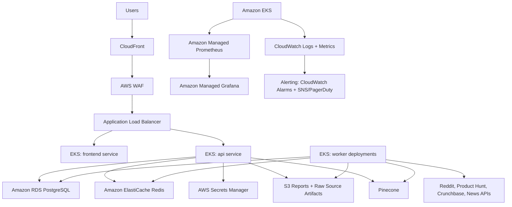
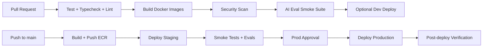

# AI Startup Copilot: CI/CD and Cloud Deployment Architecture

## 1. Objective

Deploy AI Startup Copilot as a production-grade AWS platform using Docker, Kubernetes, GitHub Actions, managed data services, observability, alerting, secrets management, and cost controls.

The architecture supports:

- Next.js frontend
- FastAPI backend
- Background workers for ingestion, RAG, reports, and evaluations
- PostgreSQL
- Redis
- Pinecone and external AI/data APIs
- Multi-environment deployments
- Secure CI/CD with minimal long-lived credentials

## 2. High-Level AWS Architecture



## 3. Environment Strategy

Use separate AWS accounts or at least separate VPCs for production and non-production.

| Environment | Purpose | Deployment Trigger | Scale |
| --- | --- | --- | --- |
| `dev` | Shared integration testing | Push to feature branch or manual dispatch | Small |
| `staging` | Release candidate validation | Push to `main` | Production-like, lower capacity |
| `prod` | Customer traffic | Approved GitHub environment deployment | Autoscaled |

Recommended AWS account layout:

- `startup-copilot-dev`
- `startup-copilot-staging`
- `startup-copilot-prod`
- Optional `startup-copilot-security` for audit logs and centralized monitoring.

## 4. Core AWS Services

| Capability | AWS Service |
| --- | --- |
| Container orchestration | Amazon EKS |
| Image registry | Amazon ECR |
| Database | Amazon RDS for PostgreSQL |
| Cache / job coordination | Amazon ElastiCache Redis |
| Object storage | Amazon S3 |
| CDN | Amazon CloudFront |
| Edge protection | AWS WAF |
| Load balancing | AWS Application Load Balancer |
| Secrets | AWS Secrets Manager + External Secrets Operator |
| IAM for pods | IAM Roles for Service Accounts |
| DNS | Amazon Route 53 |
| TLS certificates | AWS Certificate Manager |
| Logs | CloudWatch Logs |
| Metrics | Amazon Managed Service for Prometheus |
| Dashboards | Amazon Managed Grafana |
| Alerts | CloudWatch Alarms + SNS/PagerDuty/Opsgenie |
| Vulnerability scanning | ECR image scanning + GitHub CodeQL/Dependabot |

## 5. Kubernetes Architecture

### Namespaces

```text
startup-copilot-dev
startup-copilot-staging
startup-copilot-prod
observability
ingress
external-secrets
```

### Workloads

```text
frontend-deployment
  Next.js app
  Port: 3000
  HPA: CPU + request rate

api-deployment
  FastAPI app
  Port: 8000
  HPA: CPU + latency + RPS

worker-deployment
  Async ingestion, report, RAG, eval jobs
  HPA/KEDA: Redis queue length

migration-job
  Alembic migrations
  Runs before API rollout

cronjobs
  scheduled-source-refresh
  stale-vector-cleanup
  nightly-evaluations
```

### Kubernetes Objects

- `Deployment` for frontend, API, and workers.
- `Service` for internal routing.
- `Ingress` using AWS Load Balancer Controller.
- `HorizontalPodAutoscaler` for frontend/API.
- `KEDA ScaledObject` for worker queue autoscaling.
- `PodDisruptionBudget` for production services.
- `NetworkPolicy` to restrict pod-to-pod traffic.
- `ServiceAccount` with IRSA for S3, Secrets Manager, CloudWatch, and other AWS calls.
- `ExternalSecret` for secrets synced from AWS Secrets Manager.
- `ConfigMap` for non-sensitive environment configuration.

## 6. Container Image Strategy

### Images

```text
ECR:
  startup-copilot/frontend:{git_sha}
  startup-copilot/api:{git_sha}
  startup-copilot/worker:{git_sha}
```

The API and worker can share the same backend image with different commands.

### Build Standards

- Multi-stage builds.
- Non-root runtime user.
- Minimal runtime dependencies.
- Immutable image tags using Git SHA.
- Optional semantic release tags for production.
- SBOM generation.
- ECR enhanced scanning.
- Build cache enabled in GitHub Actions.

### Recommended Dockerfile Improvements

Backend:

- Split dev and production dependencies.
- Avoid installing `".[dev]"` in production.
- Add non-root user.
- Add healthcheck.

Frontend:

- Use `npm ci` instead of `npm install`.
- Use Next.js standalone output for smaller runtime image.
- Add non-root user.

## 7. CI/CD With GitHub Actions

### Workflow Overview



### GitHub Actions Jobs

1. `backend-test`
   - Install Python dependencies.
   - Run `ruff`, `mypy`, and `pytest`.
   - Run API schema checks.

2. `frontend-test`
   - Run `npm ci`.
   - Run `npm run typecheck`.
   - Run `npm run build`.

3. `security`
   - CodeQL.
   - Dependabot alerts.
   - Trivy filesystem scan.
   - Secret scanning.

4. `docker-build`
   - Build frontend image.
   - Build backend image.
   - Tag with Git SHA.
   - Push to ECR using GitHub OIDC.

5. `deploy-staging`
   - Render Helm values.
   - Run Alembic migration job.
   - Deploy with Helm upgrade.
   - Run smoke checks.

6. `ai-evals`
   - Run focused evaluation suite.
   - Block if critical reliability gates fail.

7. `deploy-prod`
   - Requires GitHub Environment approval.
   - Deploy canary or rolling release.
   - Run post-deploy checks.
   - Roll back on failed health checks.

### Authentication

Use GitHub Actions OIDC with AWS IAM roles:

```text
github-actions-dev-deploy-role
github-actions-staging-deploy-role
github-actions-prod-deploy-role
```

No long-lived AWS keys should be stored in GitHub secrets.

## 8. Deployment Method

Use Helm for Kubernetes packaging.

```text
infra/
  helm/
    startup-copilot/
      Chart.yaml
      values.yaml
      values-dev.yaml
      values-staging.yaml
      values-prod.yaml
      templates/
        frontend-deployment.yaml
        api-deployment.yaml
        worker-deployment.yaml
        service.yaml
        ingress.yaml
        hpa.yaml
        pdb.yaml
        external-secret.yaml
        migration-job.yaml
```

Deployment command:

```bash
helm upgrade --install startup-copilot ./infra/helm/startup-copilot \
  --namespace startup-copilot-prod \
  --values ./infra/helm/startup-copilot/values-prod.yaml \
  --set image.tag=${GITHUB_SHA} \
  --atomic \
  --timeout 10m
```

Use `--atomic` so failed releases roll back automatically.

## 9. Database Deployment

### RDS PostgreSQL

Production configuration:

- Multi-AZ RDS PostgreSQL.
- Encrypted at rest with KMS.
- Automated backups with point-in-time restore.
- Read replica optional for analytics-heavy workloads.
- Private subnet only.
- Security group allows access only from EKS nodes/pods.

### Migrations

- Alembic migrations run as a Kubernetes `Job`.
- Migration job runs before API deployment.
- Production migrations require:
  - Backup checkpoint.
  - Lock timeout.
  - Rollback plan.
  - No destructive schema change without migration review.

## 10. Redis Deployment

Use Amazon ElastiCache Redis.

Use cases:

- Worker queue coordination.
- Rate limiting.
- Short-lived workflow progress.
- Caching frequently requested metadata.

Production configuration:

- Multi-AZ replication group.
- Encryption in transit and at rest.
- Auth token from Secrets Manager.
- Private subnet only.

## 11. Secrets Management

### Secret Sources

Use AWS Secrets Manager for:

- Database URL or credentials.
- Redis auth token.
- JWT secret.
- Pinecone API key.
- OpenAI or model provider API keys.
- Reddit API credentials.
- Product Hunt credentials.
- Crunchbase API key.
- News API keys.

### Kubernetes Secret Sync

Use External Secrets Operator:

```text
AWS Secrets Manager -> ExternalSecret -> Kubernetes Secret -> Pod env vars
```

### Secret Rules

- No secrets in GitHub repository.
- No secrets in Docker images.
- No secrets in Helm values.
- Rotate production secrets on schedule.
- Use IRSA instead of static AWS credentials.
- Separate secrets by environment.
- Grant pods least-privilege access.

## 12. Monitoring And Observability

### Metrics

Collect:

- Request rate, latency, errors, saturation.
- API p50/p95/p99 latency.
- Frontend request latency.
- Worker queue depth.
- Job success/failure rate.
- RAG retrieval latency.
- Pinecone latency and error rate.
- LLM token usage and cost.
- Database CPU, connections, slow queries.
- Redis memory, evictions, command latency.
- Kubernetes pod restarts and pending pods.

### Logs

- Structured JSON logs from API and workers.
- CloudWatch Logs as default sink.
- Include request ID, organization ID, project ID, workflow ID, agent name, and trace ID.
- Redact secrets and PII.

### Traces

Use OpenTelemetry:

- API request traces.
- Agent workflow spans.
- Retrieval and reranking spans.
- External API calls.
- LLM calls.
- Database queries.

### Dashboards

Managed Grafana dashboards:

- Platform health.
- API performance.
- Worker and queue health.
- RAG quality and retrieval health.
- AI cost and token usage.
- Database health.
- Kubernetes capacity.
- Release health by deployment version.

## 13. Alerting

### Critical Alerts

| Alert | Threshold | Destination |
| --- | --- | --- |
| API 5xx rate | > 2% for 5 minutes | PagerDuty/SNS |
| API p95 latency | > 2s for 10 minutes | Slack/SNS |
| Frontend unavailable | ALB health check failure | PagerDuty/SNS |
| Worker queue backlog | Queue age > 15 minutes | Slack/SNS |
| RDS CPU | > 80% for 15 minutes | Slack/SNS |
| RDS connections | > 80% max connections | Slack/SNS |
| Redis evictions | Any sustained evictions | Slack/SNS |
| Pod crash loop | Any production workload | Slack/SNS |
| Secret sync failure | Any production ExternalSecret failure | PagerDuty/SNS |
| AI cost spike | > 30% day-over-day | Slack/SNS |
| Citation reliability drop | Below quality threshold | Reliability channel |

### Alert Hygiene

- Every alert has an owner and runbook.
- Page only user-impacting incidents.
- Use Slack/SNS for warning-level alerts.
- Alert on symptoms before causes.
- Add deployment version to alerts.

## 14. Security Architecture

### Network Security

- EKS, RDS, Redis in private subnets.
- Public access only through CloudFront, WAF, and ALB.
- Security groups scoped by service.
- Kubernetes NetworkPolicies restrict lateral movement.
- Egress controls for external APIs where practical.

### Identity

- GitHub OIDC for CI/CD.
- IAM Roles for Service Accounts for pods.
- Least-privilege IAM policies.
- No static AWS credentials in pods.

### Application Security

- WAF managed rules.
- Rate limits at API and edge.
- JWT secret stored in Secrets Manager.
- CORS restricted by environment.
- Dependency scanning.
- Container image scanning.
- Runtime logs redacted.

### Supply Chain

- ECR image scanning.
- SBOM generation.
- Pin action versions in GitHub Actions.
- Protect production branch.
- Require review for infrastructure changes.
- Sign images with Cosign when maturity warrants it.

## 15. Cost Optimization

### Kubernetes

- Use Cluster Autoscaler or Karpenter.
- Use mixed node groups:
  - On-demand for API/frontend baseline.
  - Spot for workers and batch jobs.
- Right-size CPU and memory requests.
- Use HPA for request-driven workloads.
- Use KEDA for queue-driven workers.
- Scale non-production environments down after hours.

### AWS Services

- RDS reserved instances or savings plans once baseline usage is stable.
- Smaller staging RDS instance with scheduled stop/start where acceptable.
- S3 lifecycle rules for raw artifacts and logs.
- CloudFront caching for static frontend assets.
- ElastiCache right-sizing after memory and command metrics stabilize.
- ECR lifecycle policy to retain recent images only.
- CloudWatch log retention policies.

### AI And Data API Costs

- Track token cost per report, per organization, and per agent.
- Cache embeddings by content hash.
- Avoid re-embedding unchanged chunks.
- Use targeted retrieval before broad web research.
- Budget limits per organization.
- Alert on API usage anomalies.

## 16. Disaster Recovery

### Recovery Targets

| Component | RPO | RTO |
| --- | --- | --- |
| RDS PostgreSQL | <= 15 minutes | <= 1 hour |
| S3 artifacts | Near zero | <= 1 hour |
| EKS workloads | Image/state redeploy | <= 30 minutes |
| Redis cache/queues | Best effort for transient jobs | <= 30 minutes |
| Pinecone vectors | Rebuildable from Postgres/S3 | <= 24 hours |

### DR Practices

- RDS point-in-time restore.
- S3 versioning for report artifacts.
- Nightly export of critical metadata.
- Rebuild Pinecone from stored chunks.
- Infrastructure as Code for repeatable environments.
- Quarterly restore drills.

## 17. Infrastructure As Code

Use Terraform for AWS infrastructure and Helm for app deployment.

```text
infra/
  terraform/
    modules/
      vpc/
      eks/
      rds/
      elasticache/
      s3/
      ecr/
      iam/
      observability/
    envs/
      dev/
      staging/
      prod/
  helm/
    startup-copilot/
```

Terraform manages:

- VPC, subnets, route tables.
- EKS cluster and node groups.
- ECR repositories.
- RDS and ElastiCache.
- S3 buckets.
- IAM roles and policies.
- Secrets Manager secret shells.
- CloudWatch alarms.
- Route 53 and ACM.

Helm manages:

- Deployments.
- Services.
- Ingress.
- HPA/KEDA.
- ExternalSecret mappings.
- Migration jobs.
- ConfigMaps.

## 18. Recommended GitHub Actions Workflows

```text
.github/
  workflows/
    pr-checks.yml
    build-images.yml
    deploy-staging.yml
    deploy-production.yml
    nightly-evals.yml
    dependency-scan.yml
```

### Production Deployment Controls

- Protected `main` branch.
- Required PR checks.
- Required security scan.
- Required staging smoke test.
- Required AI eval smoke test.
- GitHub Environment approval for production.
- Deployment lock to prevent concurrent prod deploys.

## 19. Rollout Strategy

### Staging

- Rolling deployment.
- Run migrations.
- Run smoke tests:
  - `/api/v1/health`
  - frontend `/login`
  - auth route sanity
  - project list route
  - worker queue ping

### Production

Recommended first stage:

- Rolling deployment with `maxUnavailable=0`.
- Fast rollback via Helm.

Mature stage:

- Canary deployment with Argo Rollouts.
- Route 5%, 25%, 50%, then 100%.
- Promote only if latency, error rate, and eval smoke checks pass.

## 20. Complete Deployment Flow

1. Developer opens pull request.
2. GitHub Actions runs frontend, backend, security, and focused AI eval checks.
3. Merge to `main`.
4. Images are built and pushed to ECR with Git SHA tags.
5. Staging deployment runs:
   - Alembic migration job.
   - Helm upgrade.
   - Smoke tests.
   - AI eval smoke suite.
6. Production deployment waits for approval.
7. Production migration job runs.
8. Helm deploys frontend, API, and workers.
9. Post-deploy checks validate health, latency, and error rates.
10. Monitoring dashboards and alerts track release health.
11. Failed deployment rolls back automatically or via Helm rollback.

## 21. Production Readiness Checklist

- AWS accounts and VPCs created.
- EKS cluster with private nodes.
- ECR repositories created.
- RDS Multi-AZ PostgreSQL provisioned.
- ElastiCache Redis provisioned.
- S3 buckets with encryption and lifecycle policies.
- Secrets created in AWS Secrets Manager.
- External Secrets Operator installed.
- AWS Load Balancer Controller installed.
- CloudFront, WAF, Route 53, and ACM configured.
- GitHub OIDC roles configured.
- Helm chart created.
- Terraform modules committed.
- CI/CD workflows enabled.
- Dashboards and alerts configured.
- Runbooks written.
- DR restore drill completed.

