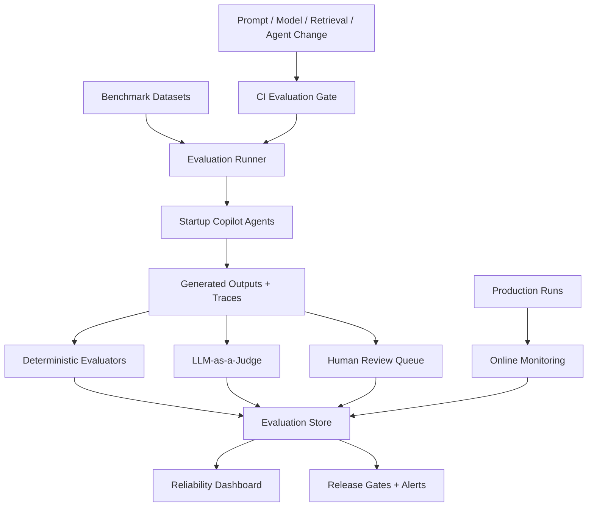

# AI Startup Copilot: Evaluation Framework

## 1. Objective

Design a production-grade evaluation framework for AI Startup Copilot that measures model, retrieval, agent, and report quality across the core product outputs:

- Competitor Accuracy
- Market Analysis Accuracy
- Financial Projection Accuracy
- Sentiment Accuracy
- Recommendation Quality

The framework combines automated tests, benchmark datasets, LLM-as-a-Judge, human expert review, production monitoring, and feedback loops into one reliability system.

## 2. Evaluation Architecture



## 3. Metric Definitions

### Competitor Accuracy

Measures whether discovered competitors are real, relevant, correctly classified, and well-supported.

| Submetric | Definition | Scoring |
| --- | --- | --- |
| Entity validity | Company/product exists and source URL is valid | Binary |
| Relevance | Competitor matches target customer, problem, or solution category | 1-5 |
| Classification accuracy | Direct, indirect, or adjacent classification is correct | Binary or 1-3 |
| Coverage | Expected competitors found from benchmark set | Recall |
| False positive rate | Irrelevant or fabricated competitors included | Percentage |
| Citation support | Claims about competitor are source-backed | Percentage |

Primary score:

```text
competitor_accuracy =
  0.25 * entity_validity
+ 0.25 * relevance
+ 0.20 * classification_accuracy
+ 0.20 * benchmark_recall
+ 0.10 * citation_support
- false_positive_penalty
```

### Market Analysis Accuracy

Measures whether market trends, customer segments, market sizing, and constraints are evidence-grounded.

| Submetric | Definition |
| --- | --- |
| Source authority | Uses credible and current sources |
| Claim support | Market claims are supported by citations |
| Market sizing validity | TAM/SAM/SOM methodology is explainable and not fabricated |
| Geography fit | Sources match requested geography |
| Freshness | Time-sensitive claims use recent sources |
| Uncertainty handling | Sparse evidence is labeled clearly |

### Financial Projection Accuracy

Measures whether formulas, assumptions, and scenario outputs are mathematically correct and responsibly framed.

| Submetric | Definition |
| --- | --- |
| Formula correctness | Revenue, COGS, gross profit, burn, runway, and break-even calculations are correct |
| Scenario consistency | Conservative/base/aggressive scenarios scale coherently |
| Assumption traceability | Every assumption is editable, visible, and approved or labeled |
| Bounds sanity | Growth, churn, margin, and conversion assumptions are within plausible ranges |
| No invented traction | Generated projections do not imply real historical performance |

Financial projections should use deterministic evaluators first. LLM judges can evaluate explanation quality, but not replace formula tests.

### Sentiment Accuracy

Measures whether Reddit and other social/customer-signal sentiment is classified correctly and summarized without overgeneralization.

| Submetric | Definition |
| --- | --- |
| Label accuracy | Positive, neutral, negative, or mixed labels match human annotations |
| Topic coherence | Clustered topics are internally consistent |
| Evidence fit | Representative posts/comments support the sentiment summary |
| PII safety | Usernames and sensitive details are not exposed |
| Representativeness | Anecdotes are not framed as statistical proof |

### Recommendation Quality

Measures whether final recommendations are useful, specific, evidence-backed, and appropriately cautious.

| Submetric | Definition |
| --- | --- |
| Actionability | Founder can act on the recommendation |
| Evidence grounding | Recommendation follows from cited research |
| Strategic specificity | Avoids generic startup advice |
| Risk awareness | Identifies uncertainty, assumptions, and constraints |
| Prioritization quality | Next steps are ordered by impact and risk reduction |
| Stage fit | Advice matches idea, prototype, launched, or scaling stage |

## 4. Automated Evaluation Pipeline

### Pipeline Triggers

- Pull request changes to prompts, agents, retrieval, ranking, chunking, or financial formulas.
- Scheduled nightly regression run.
- New model or embedding model candidate.
- Pinecone reindexing.
- Production drift alert.
- Manual reliability audit.

### Pipeline Stages

1. Select benchmark slice by changed subsystem.
2. Run controlled agent workflow with fixed seeds where supported.
3. Capture full traces: prompts, retrieved chunks, citations, tool calls, model names, token usage, and outputs.
4. Run deterministic checks.
5. Run LLM-as-a-Judge checks.
6. Sample outputs for human review when confidence is low or change risk is high.
7. Compare against baseline.
8. Pass, warn, or block release.

### Deterministic Checks

- JSON schema validity.
- Required section coverage.
- Citation ID existence.
- Citation URL validity.
- No fabricated source IDs.
- No unsupported market-size numbers.
- Financial formulas match calculation engine.
- Tenant namespace filter present in retrieval trace.
- No PII leakage in Reddit outputs.
- No prompt-injection text copied into final answer.

### Release Gates

| Gate | Block Condition |
| --- | --- |
| Citation integrity | Any fabricated citation in benchmark run |
| Financial correctness | Any formula regression in golden cases |
| Competitor hallucination | Fabricated competitor rate above 0 |
| PII safety | Any unredacted high-risk PII |
| Quality regression | Composite score drops more than 5% from baseline |
| Cost regression | Median cost increases more than 25% without approval |

## 5. Benchmark Datasets

### Dataset Structure

```text
evals/
  datasets/
    competitor_accuracy/
      b2b_saas.jsonl
      consumer_apps.jsonl
      marketplaces.jsonl
    market_analysis/
      healthcare_us.jsonl
      fintech_india.jsonl
      climate_global.jsonl
    financial_projection/
      subscription_saas.jsonl
      marketplace_take_rate.jsonl
      services_business.jsonl
    sentiment/
      reddit_labeled_threads.jsonl
      product_feedback_snippets.jsonl
    recommendations/
      stage_fit_cases.jsonl
      investor_readiness_cases.jsonl
```

### Standard Example Format

```json
{
  "case_id": "competitor_b2b_saas_001",
  "task_type": "competitor_accuracy",
  "startup_idea": "AI assistant for SOC 2 evidence collection for seed-stage SaaS teams",
  "industry": "B2B SaaS",
  "geography": "United States",
  "stage": "idea",
  "expected_outputs": {
    "known_competitors": [
      {
        "name": "Vanta",
        "classification": "direct",
        "required": true
      },
      {
        "name": "Drata",
        "classification": "direct",
        "required": true
      }
    ],
    "must_not_include": ["fabricated companies"]
  },
  "reference_sources": [
    {
      "title": "Authoritative source title",
      "url": "https://example.com",
      "source_type": "company_profile"
    }
  ],
  "rubric": "competitor_accuracy_v1"
}
```

### Dataset Types

| Dataset | Purpose | Owner |
| --- | --- | --- |
| Golden set | Stable release gate cases | AI Reliability |
| Challenge set | Hard edge cases and adversarial prompts | AI Reliability + Security |
| Freshness set | Current market/news cases refreshed monthly | Research Ops |
| Human-labeled sentiment set | Reddit snippets with sentiment labels | Data Annotation |
| Financial formula set | Deterministic spreadsheet-like cases | Finance SME |
| Production sample set | Anonymized real user cases | Product + Reliability |

### Dataset Governance

- Version every dataset.
- Freeze golden set during a release cycle.
- Track source retrieval date.
- Keep benchmark answers separate from prompts.
- Prevent training contamination by excluding eval labels from model context.
- Refresh time-sensitive market cases monthly.

## 6. LLM-as-a-Judge Framework

### Judge Responsibilities

Use LLM judges for qualitative evaluation where deterministic checks are insufficient:

- Competitor relevance.
- Market analysis coherence.
- Recommendation usefulness.
- Evidence-to-claim support.
- Strategic specificity.
- Risk and uncertainty handling.

Do not use LLM judges as the only evaluator for:

- Financial math.
- Citation existence.
- URL validity.
- PII detection.
- Tenant isolation.

### Judge Inputs

Each judge receives:

- Original user/startup idea.
- Agent output.
- Retrieved evidence snippets with citation handles.
- Rubric.
- Known benchmark labels when applicable.
- Instructions to ignore unsupported model prior knowledge.

### Judge Rubric Format

```json
{
  "rubric_id": "recommendation_quality_v1",
  "score_range": [1, 5],
  "criteria": [
    {
      "name": "actionability",
      "description": "The recommendation contains specific next actions a founder can execute.",
      "weight": 0.25
    },
    {
      "name": "evidence_grounding",
      "description": "The recommendation follows from cited evidence and labeled assumptions.",
      "weight": 0.30
    },
    {
      "name": "stage_fit",
      "description": "The recommendation matches the startup stage.",
      "weight": 0.20
    },
    {
      "name": "risk_awareness",
      "description": "Important uncertainties and risks are surfaced.",
      "weight": 0.15
    },
    {
      "name": "specificity",
      "description": "The output avoids generic advice.",
      "weight": 0.10
    }
  ]
}
```

### Judge Prompt Skeleton

```text
You are evaluating AI Startup Copilot output.
Use only the provided startup brief, generated output, benchmark expectations, and retrieved evidence.
Do not reward unsupported claims.
Do not penalize the model for refusing to answer when evidence is insufficient.
Score each criterion from 1 to 5.
Return JSON only with scores, rationale, unsupported_claims, and improvement_suggestions.
```

### Judge Calibration

- Maintain a human-labeled calibration set.
- Measure judge-human agreement by metric and industry.
- Require minimum agreement before trusting judge scores in release gates.
- Use pairwise comparison for model selection.
- Rotate or ensemble judges for high-risk changes.
- Audit judge drift monthly.

### Judge Output

```json
{
  "case_id": "recommendation_012",
  "rubric_id": "recommendation_quality_v1",
  "overall_score": 4.2,
  "criterion_scores": {
    "actionability": 5,
    "evidence_grounding": 4,
    "stage_fit": 4,
    "risk_awareness": 4,
    "specificity": 4
  },
  "unsupported_claims": [],
  "rationale": "The recommendation is specific and tied to cited customer pain points.",
  "requires_human_review": false
}
```

## 7. Human Review Workflow

### Review Queues

| Queue | Trigger |
| --- | --- |
| Expert market review | Market analysis score below threshold or high-impact report |
| Finance review | Projection assumptions outside safe bounds |
| Competitor review | Low recall or high false positive risk |
| Sentiment review | Low judge confidence, sarcasm-heavy Reddit samples, or sensitive content |
| Recommendation review | Investor-readiness or final recommendation below threshold |
| Safety review | PII, prompt injection, or unsupported claim risk |

### Reviewer Roles

- AI Reliability Engineer: owns rubrics, eval health, regression triage.
- Market Research Analyst: reviews market claims and source quality.
- Finance SME: reviews financial assumptions and formulas.
- Product Strategist: reviews recommendation quality.
- Safety Reviewer: reviews PII, sensitive content, and prompt injection failures.

### Review UI Requirements

Reviewers need:

- Startup brief.
- Generated output.
- Retrieved chunks and citations.
- Agent trace summary.
- Prior baseline output.
- Rubric with anchored examples.
- Buttons: approve, minor issue, major issue, block release.
- Field-level correction capture.

### Human Review Outcomes

```json
{
  "review_id": "uuid",
  "case_id": "string",
  "reviewer_role": "finance_sme",
  "decision": "approve | minor_issue | major_issue | block",
  "scores": {
    "financial_projection_accuracy": 4
  },
  "corrections": [
    {
      "field": "gross_margin",
      "issue": "Margin assumption too high for services-heavy onboarding",
      "suggested_fix": "Use 55-65% in base case"
    }
  ]
}
```

### Escalation Rules

- Any fabricated citation blocks release.
- Any PII exposure goes to safety review.
- Any financial formula error goes to engineering triage.
- Any repeated market-source issue opens a retrieval-quality task.
- Any low recommendation score on production sample opens a product-quality review.

## 8. Monitoring Dashboard

### Dashboard Sections

#### Executive Reliability

- Overall AI quality score.
- Release gate pass/fail status.
- Production unsupported claim rate.
- Citation coverage.
- Cost per report.
- Human escalation rate.

#### Metric Scorecards

| Scorecard | Core Charts |
| --- | --- |
| Competitor Accuracy | Recall, false positives, fabricated entities, citation support |
| Market Analysis Accuracy | Claim support, source authority, freshness, geography match |
| Financial Projection Accuracy | Formula pass rate, assumption override rate, outlier flags |
| Sentiment Accuracy | Label accuracy, topic coherence, PII redaction, representativeness warnings |
| Recommendation Quality | Judge score, human score, actionability, stage fit, user acceptance |

#### RAG Health

- Retrieval hit rate.
- Reranker score distribution.
- Source diversity.
- Freshness by source type.
- Pinecone latency.
- Empty retrieval rate.
- Citation repair rate.

#### Agent Health

- Agent success rate.
- Retry rate.
- Schema failure rate.
- Tool failure rate.
- Average latency.
- Token and cost trends.
- Quality score by prompt version.

#### Production Feedback

- User thumbs up/down.
- Regeneration rate.
- Section edit distance.
- Export completion rate.
- Human approval rejection rate.
- Common complaint categories.

### Alerting

| Alert | Threshold |
| --- | --- |
| Citation coverage drop | Below 95% for factual claims |
| Unsupported claim spike | Above 3% rolling 24h |
| Financial formula failure | Any production incident |
| Competitor hallucination | Any confirmed fabricated company |
| Sentiment PII leakage | Any confirmed incident |
| Retrieval empty rate | Above 15% by source/task |
| Cost spike | Above 30% week-over-week |

## 9. Backend Implementation Shape

Add evaluation modules under the existing backend architecture:

```text
backend/
  app/
    domain/
      evaluation_entities.py
      evaluation_repositories.py
      evaluation_services.py
    application/
      evaluation_dto.py
      use_cases/
        evaluation_run_use_cases.py
        benchmark_use_cases.py
        human_review_use_cases.py
    infrastructure/
      evaluation/
        runner.py
        deterministic_checks.py
        llm_judges.py
        rubrics.py
        baseline_compare.py
      monitoring/
        metrics.py
        dashboards.py
        alerts.py
    api/
      v1/
        evaluations.py
        benchmarks.py
        reviews.py
```

## 10. Evaluation Store

Recommended Postgres tables:

```text
evaluation_runs
  id
  trigger_type
  model_version
  prompt_versions
  retrieval_version
  dataset_version
  status
  started_at
  completed_at
  summary_json

evaluation_cases
  id
  dataset_name
  dataset_version
  task_type
  input_json
  expected_json
  rubric_id

evaluation_results
  id
  run_id
  case_id
  agent_name
  output_json
  trace_json
  deterministic_scores_json
  judge_scores_json
  human_scores_json
  pass_status

human_reviews
  id
  result_id
  reviewer_id
  reviewer_role
  decision
  scores_json
  corrections_json
  created_at
```

## 11. Implementation Plan

### Phase 1: Evaluation Foundation

- Define rubrics for the five core metrics.
- Create golden benchmark JSONL format.
- Add evaluation result tables.
- Implement deterministic checks for schema, citations, PII, and financial formulas.
- Store agent traces consistently.

### Phase 2: Benchmark Datasets

- Build 20 golden competitor cases.
- Build 20 market analysis cases across industries and geographies.
- Build 30 deterministic financial projection cases.
- Label 500 Reddit/comment snippets for sentiment.
- Build 20 recommendation quality cases by startup stage.

### Phase 3: LLM-as-a-Judge

- Implement judge prompts and structured outputs.
- Add judge-human calibration set.
- Measure agreement.
- Add pairwise model comparison.
- Add judge confidence and human escalation rules.

### Phase 4: Human Review

- Add review queues.
- Build reviewer UI in the Reports or internal Settings area.
- Capture corrections as structured feedback.
- Feed corrections into benchmark expansion and prompt improvements.

### Phase 5: CI/CD Gates

- Run focused evals on pull requests.
- Run full eval suite nightly.
- Block release on critical reliability failures.
- Track baseline deltas by model, prompt, retrieval, and embedding version.

### Phase 6: Production Monitoring

- Add online quality events.
- Build dashboard views.
- Add alerts for critical regressions.
- Sample production outputs for human review.
- Create weekly reliability report.

## 12. Target Reliability Thresholds

| Metric | Launch Target | Mature Target |
| --- | --- | --- |
| Competitor Accuracy | >= 80% | >= 90% |
| Market Analysis Accuracy | >= 75% | >= 88% |
| Financial Projection Accuracy | >= 95% formula pass | >= 99% formula pass |
| Sentiment Accuracy | >= 78% | >= 88% |
| Recommendation Quality | >= 4.0/5 | >= 4.4/5 |
| Citation Coverage | >= 95% | >= 98% |
| Fabricated Citation Rate | 0% | 0% |
| PII Leakage | 0 known incidents | 0 known incidents |

## 13. Reliability Operating Model

- Treat evals as product infrastructure, not one-time QA.
- Every prompt and retrieval change must declare expected quality impact.
- Every benchmark failure needs an owner.
- Human review corrections become future eval cases.
- Production monitoring decides what the benchmark set is missing.
- The system should prefer honest uncertainty over confident unsupported answers.

