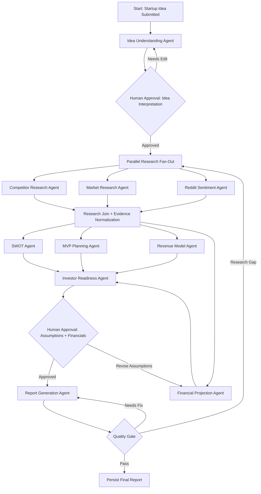

# AI Startup Copilot: LangGraph Multi-Agent Architecture

## 1. Architecture Overview

AI Startup Copilot uses LangGraph to orchestrate a production-grade multi-agent workflow that transforms a raw startup idea into a validated, source-grounded startup report. The system uses typed state, explicit graph transitions, retryable nodes, tool-scoped agents, human approval checkpoints, and quality gates before final report generation.

The architecture is designed for:

- Deterministic orchestration with flexible AI reasoning.
- Modular agents with clear contracts.
- Recoverable long-running workflows.
- Source-grounded RAG outputs.
- Tenant-safe memory and retrieval.
- Human review at high-risk decision points.
- Measurable agent quality and cost.

## 2. Graph Flow



### Execution Pattern

- `Idea Understanding Agent` runs first and establishes canonical project context.
- Research agents run in parallel to reduce latency.
- Strategy agents consume normalized evidence.
- `Investor Readiness Agent` depends on SWOT, MVP, revenue, and financial outputs.
- `Report Generation Agent` only runs after approval and quality prechecks.
- LangGraph checkpointing persists state after every node.

## 3. Shared State Design

Use a strongly typed state object. In Python, define this with Pydantic or TypedDict.

```python
from typing import Any, Literal
from pydantic import BaseModel, Field

class Source(BaseModel):
    source_id: str
    title: str | None = None
    url: str | None = None
    source_type: str
    publisher: str | None = None
    retrieved_at: str
    published_at: str | None = None
    credibility_score: float | None = None
    relevance_score: float | None = None

class EvidenceItem(BaseModel):
    evidence_id: str
    claim: str
    source_ids: list[str] = Field(default_factory=list)
    confidence_score: float
    evidence_type: str

class AgentRun(BaseModel):
    agent_name: str
    status: Literal["pending", "running", "succeeded", "failed", "skipped"]
    started_at: str | None = None
    completed_at: str | None = None
    error_code: str | None = None
    retry_count: int = 0
    cost_usd: float = 0
    latency_ms: int | None = None

class StartupCopilotState(BaseModel):
    workflow_id: str
    organization_id: str
    project_id: str
    user_id: str
    workflow_status: Literal["running", "waiting_for_human", "succeeded", "failed"]

    raw_idea: str
    canonical_idea: dict[str, Any] = Field(default_factory=dict)
    assumptions: list[dict[str, Any]] = Field(default_factory=list)
    human_feedback: list[dict[str, Any]] = Field(default_factory=list)

    sources: list[Source] = Field(default_factory=list)
    evidence: list[EvidenceItem] = Field(default_factory=list)

    competitor_analysis: dict[str, Any] = Field(default_factory=dict)
    market_research: dict[str, Any] = Field(default_factory=dict)
    reddit_sentiment: dict[str, Any] = Field(default_factory=dict)
    swot_analysis: dict[str, Any] = Field(default_factory=dict)
    mvp_plan: dict[str, Any] = Field(default_factory=dict)
    revenue_model: dict[str, Any] = Field(default_factory=dict)
    financial_projection: dict[str, Any] = Field(default_factory=dict)
    investor_readiness: dict[str, Any] = Field(default_factory=dict)
    final_report: dict[str, Any] = Field(default_factory=dict)

    agent_runs: list[AgentRun] = Field(default_factory=list)
    warnings: list[dict[str, Any]] = Field(default_factory=list)
    quality_scores: dict[str, float] = Field(default_factory=dict)
```

### State Rules

- Agents may only write to their assigned state keys.
- All source-backed claims must reference `source_ids`.
- Unsupported claims must be marked as assumptions.
- Human feedback is append-only.
- Agent outputs must be valid JSON matching the output schema.
- Every node records latency, retries, token usage, and estimated cost.

## 4. Memory Design

### Short-Term Workflow Memory

Stored in LangGraph checkpoint storage.

Purpose:

- Resume interrupted workflows.
- Preserve intermediate agent outputs.
- Support approval pauses.
- Avoid repeating successful research steps.

Recommended backend:

- PostgreSQL checkpoint saver for durable production workflows.
- Redis only for ephemeral progress updates, not canonical workflow state.

### Long-Term Project Memory

Stored in PostgreSQL and Pinecone.

Includes:

- Prior reports
- User-edited assumptions
- Approved customer segments
- Saved competitors
- Historical scoring results
- Founder preferences
- Generated personas

### Vector Memory

Stored in Pinecone with organization-scoped namespaces.

Collections:

- `startup-ideas`
- `report-sections`
- `competitor-profiles`
- `market-sources`
- `reddit-insights`
- `approved-assumptions`

Retrieval filters:

- `organization_id`
- `project_id`
- `report_type`
- `source_type`
- `retrieved_at`
- `approved_by_user`

### Memory Safety

- Never retrieve across organizations.
- Do not use unapproved user drafts as facts.
- Separate raw external text from trusted synthesized evidence.
- Mark stale memories and external sources with retrieval dates.
- Apply prompt-injection filtering before retrieved content enters agent context.

## 5. Human Approval Checkpoints

### Checkpoint 1: Idea Interpretation Approval

Occurs after `Idea Understanding Agent`.

User reviews:

- Canonical startup idea
- Target customer
- Geography
- Industry
- Problem statement
- Key assumptions
- Research keywords

Purpose:

- Prevent downstream research from optimizing around the wrong interpretation.
- Let users correct assumptions early.

### Checkpoint 2: Assumptions And Financial Approval

Occurs before final report generation.

User reviews:

- Pricing assumption
- Conversion assumptions
- Customer acquisition assumptions
- Headcount assumptions
- Revenue model selection
- Market-size confidence

Purpose:

- Avoid presenting speculative financials as final recommendations.
- Improve investor-readiness scoring quality.

### Optional Enterprise Checkpoint: Source Review

For accelerators, consultants, or enterprise accounts.

User reviews:

- Sources used
- Excluded sources
- Competitor list
- Reddit communities analyzed

## 6. Agent Specifications

## 6.1 Idea Understanding Agent

### Purpose

Convert a raw startup idea into a canonical structured brief that downstream agents can use consistently.

### Input Schema

```json
{
  "raw_idea": "string",
  "user_context": {
    "industry": "string | null",
    "geography": "string | null",
    "target_customer": "string | null",
    "known_competitors": ["string"],
    "stage": "idea | prototype | launched | scaling"
  }
}
```

### Output Schema

```json
{
  "canonical_idea": {
    "one_line_description": "string",
    "problem_statement": "string",
    "proposed_solution": "string",
    "target_customers": ["string"],
    "buyer_personas": ["string"],
    "industry": "string",
    "geography": "string",
    "business_type": "B2B | B2C | B2B2C | Marketplace | Other",
    "research_keywords": ["string"],
    "known_competitors": ["string"]
  },
  "assumptions": [
    {
      "assumption": "string",
      "type": "customer | market | product | revenue | distribution | technical",
      "risk_level": "low | medium | high"
    }
  ],
  "clarifying_questions": ["string"],
  "confidence_score": 0.0
}
```

### Tools Used

- Project memory retriever
- Keyword expansion tool
- Industry taxonomy mapper
- Prompt-injection detector

### System Prompt

```text
You are the Idea Understanding Agent for AI Startup Copilot.
Your job is to convert a user's raw startup idea into a precise, structured startup brief.
Do not validate the idea yet. Do not invent market data, competitors, revenue numbers, or traction.
Identify assumptions clearly. If required fields are missing, produce concise clarifying questions.
Return only valid JSON matching the required schema.
```

### Failure Handling

- If idea is too vague, return clarifying questions and set low confidence.
- If input contains prompt injection, strip malicious instructions and add a warning.
- If schema validation fails, retry once with validation error feedback.
- If still invalid, route to human review.

### Evaluation Metrics

- Schema validity rate
- Human correction rate
- Assumption precision
- Downstream research success rate
- Average confidence calibration

## 6.2 Competitor Research Agent

### Purpose

Discover and compare direct, indirect, and adjacent competitors.

### Input Schema

```json
{
  "canonical_idea": {},
  "known_competitors": ["string"],
  "geography": "string",
  "research_keywords": ["string"]
}
```

### Output Schema

```json
{
  "competitors": [
    {
      "name": "string",
      "website": "string | null",
      "type": "direct | indirect | adjacent",
      "description": "string",
      "target_customer": "string",
      "pricing_summary": "string | null",
      "feature_summary": ["string"],
      "positioning": "string",
      "funding_or_traction": "string | null",
      "similarity_score": 0.0,
      "differentiation_gap": "string",
      "source_ids": ["string"]
    }
  ],
  "competitive_landscape_summary": "string",
  "confidence_score": 0.0
}
```

### Tools Used

- Search API
- Company enrichment API
- Website scraper with robots and terms compliance
- Pinecone similarity search
- Source credibility scorer

### System Prompt

```text
You are the Competitor Research Agent.
Find relevant competitors for the startup idea using only provided tools and retrieved evidence.
Classify competitors as direct, indirect, or adjacent.
Do not fabricate companies, funding, pricing, or source URLs.
Every factual claim must reference source_ids.
Return only valid JSON matching the required schema.
```

### Failure Handling

- If search API fails, retry with exponential backoff.
- If sources are sparse, return fewer competitors with lower confidence.
- If company data conflicts, include conflict warning.
- If website scraping fails, use search snippets and mark lower confidence.

### Evaluation Metrics

- Competitor precision
- Source coverage per competitor
- Duplicate competitor rate
- User add/remove rate
- Similarity score calibration

## 6.3 Market Research Agent

### Purpose

Analyze market opportunity, customer segments, trends, constraints, and market-size assumptions.

### Input Schema

```json
{
  "canonical_idea": {},
  "target_customers": ["string"],
  "industry": "string",
  "geography": "string",
  "research_keywords": ["string"]
}
```

### Output Schema

```json
{
  "market_summary": "string",
  "customer_segments": [
    {
      "segment": "string",
      "needs": ["string"],
      "willingness_to_pay_signal": "low | medium | high | unknown"
    }
  ],
  "market_trends": [
    {
      "trend": "string",
      "impact": "low | medium | high",
      "source_ids": ["string"]
    }
  ],
  "tam_sam_som": {
    "tam": "string | null",
    "sam": "string | null",
    "som": "string | null",
    "methodology": "string",
    "confidence_score": 0.0
  },
  "barriers_to_entry": ["string"],
  "confidence_score": 0.0
}
```

### Tools Used

- Search API
- Market data provider
- News/trend API
- Source credibility scorer
- RAG retriever

### System Prompt

```text
You are the Market Research Agent.
Analyze the market using retrieved evidence. Separate sourced facts from assumptions.
Do not invent market-size numbers. If reliable market-size data is unavailable, provide a methodology and mark estimates as assumptions.
Prioritize recent, authoritative, geography-relevant sources.
Return only valid JSON matching the required schema.
```

### Failure Handling

- If no reliable market-size source exists, produce qualitative market analysis.
- If sources are outdated, flag freshness risk.
- If trend data conflicts, preserve both views and mark uncertainty.

### Evaluation Metrics

- Source authority score
- Unsupported market claim rate
- Freshness of sources
- User trust rating
- Estimate confidence calibration

## 6.4 Reddit Sentiment Agent

### Purpose

Mine Reddit discussions for authentic user pain points, sentiment, objections, and alternative solutions.

### Input Schema

```json
{
  "canonical_idea": {},
  "target_customers": ["string"],
  "research_keywords": ["string"],
  "subreddit_hints": ["string"]
}
```

### Output Schema

```json
{
  "subreddits_analyzed": ["string"],
  "topics": [
    {
      "topic": "string",
      "sentiment": "negative | neutral | positive | mixed",
      "sentiment_score": 0.0,
      "pain_points": ["string"],
      "current_alternatives": ["string"],
      "buying_signals": ["string"],
      "objections": ["string"],
      "representative_source_ids": ["string"]
    }
  ],
  "summary": "string",
  "confidence_score": 0.0
}
```

### Tools Used

- Reddit API
- Subreddit discovery tool
- Sentiment classifier
- Topic clustering tool
- Toxicity and privacy filter

### System Prompt

```text
You are the Reddit Sentiment Agent.
Analyze Reddit discussions to identify customer pain points, sentiment, objections, and alternatives.
Respect privacy and platform policy. Do not expose usernames or sensitive personal details.
Do not treat Reddit anecdotes as statistically representative market facts.
Return only valid JSON matching the required schema.
```

### Failure Handling

- If Reddit API is rate-limited, resume job later.
- If no relevant posts are found, return empty topics and low confidence.
- If content includes personal data, redact it.
- If subreddit quality is low, flag representativeness risk.

### Evaluation Metrics

- Relevant post retrieval rate
- Topic coherence score
- Sentiment classifier agreement
- PII redaction rate
- User-rated insight usefulness

## 6.5 SWOT Agent

### Purpose

Convert research evidence into strategic strengths, weaknesses, opportunities, and threats.

### Input Schema

```json
{
  "canonical_idea": {},
  "competitor_analysis": {},
  "market_research": {},
  "reddit_sentiment": {},
  "assumptions": []
}
```

### Output Schema

```json
{
  "strengths": [{"item": "string", "rationale": "string", "source_ids": ["string"]}],
  "weaknesses": [{"item": "string", "rationale": "string", "source_ids": ["string"]}],
  "opportunities": [{"item": "string", "rationale": "string", "source_ids": ["string"]}],
  "threats": [{"item": "string", "rationale": "string", "source_ids": ["string"]}],
  "strategic_summary": "string",
  "confidence_score": 0.0
}
```

### Tools Used

- Evidence retriever
- Strategic framework library
- Consistency checker

### System Prompt

```text
You are the SWOT Agent.
Create a concise, evidence-grounded SWOT analysis.
Strengths and weaknesses should primarily describe the startup concept.
Opportunities and threats should primarily describe external market conditions.
Do not repeat generic business advice.
Return only valid JSON matching the required schema.
```

### Failure Handling

- If evidence is incomplete, use assumptions and mark lower confidence.
- If SWOT items overlap, deduplicate and rewrite.
- If claims lack source IDs, route to quality repair.

### Evaluation Metrics

- Evidence coverage
- Duplicate item rate
- Strategic specificity score
- User edit rate

## 6.6 MVP Planning Agent

### Purpose

Generate a practical MVP plan with prioritized features, validation experiments, milestones, and success metrics.

### Input Schema

```json
{
  "canonical_idea": {},
  "market_research": {},
  "reddit_sentiment": {},
  "competitor_analysis": {},
  "assumptions": []
}
```

### Output Schema

```json
{
  "mvp_goal": "string",
  "must_have_features": [
    {
      "feature": "string",
      "user_value": "string",
      "impact": "low | medium | high",
      "effort": "low | medium | high",
      "risk_reduction": "low | medium | high"
    }
  ],
  "excluded_features": [{"feature": "string", "reason": "string"}],
  "validation_experiments": [
    {
      "experiment": "string",
      "hypothesis": "string",
      "success_metric": "string",
      "timeframe": "string"
    }
  ],
  "milestones": ["string"],
  "confidence_score": 0.0
}
```

### Tools Used

- Feature prioritization engine
- Experiment template library
- Persona memory retriever
- Effort estimation heuristic

### System Prompt

```text
You are the MVP Planning Agent.
Design the smallest credible MVP that validates the riskiest assumptions.
Prefer learning speed over feature breadth.
Clearly separate must-have features from later features.
Return only valid JSON matching the required schema.
```

### Failure Handling

- If scope is too broad, force-rank features and reduce MVP.
- If technical feasibility is unclear, add technical validation experiment.
- If target customer is unclear, route warning to Idea Understanding Agent.

### Evaluation Metrics

- MVP scope size
- Experiment quality score
- Risk coverage
- User implementation rating

## 6.7 Revenue Model Agent

### Purpose

Recommend monetization models, pricing hypotheses, revenue streams, and validation tests.

### Input Schema

```json
{
  "canonical_idea": {},
  "customer_segments": [],
  "competitor_analysis": {},
  "market_research": {},
  "mvp_plan": {}
}
```

### Output Schema

```json
{
  "recommended_model": {
    "model_type": "subscription | usage_based | transaction_fee | marketplace | licensing | services | advertising | hybrid",
    "rationale": "string",
    "source_ids": ["string"]
  },
  "alternative_models": [{"model_type": "string", "pros": ["string"], "cons": ["string"]}],
  "pricing_hypotheses": [
    {
      "customer_segment": "string",
      "price_point": "string",
      "assumption": "string",
      "validation_method": "string"
    }
  ],
  "monetization_risks": ["string"],
  "confidence_score": 0.0
}
```

### Tools Used

- Pricing benchmark retriever
- Competitor pricing extractor
- Revenue model library
- Assumption validator

### System Prompt

```text
You are the Revenue Model Agent.
Recommend monetization options grounded in customer behavior, competitor pricing, and business type.
Do not claim validated willingness to pay unless evidence exists.
All pricing should be framed as hypotheses until validated.
Return only valid JSON matching the required schema.
```

### Failure Handling

- If pricing evidence is unavailable, produce testable hypotheses.
- If competitor pricing is opaque, mark as unknown.
- If multiple viable models exist, recommend staged monetization.

### Evaluation Metrics

- Pricing evidence coverage
- Hypothesis testability
- User-selected recommendation rate
- Revenue model consistency with MVP

## 6.8 Investor Readiness Agent

### Purpose

Score the startup idea’s readiness for investor conversations and identify fundraising gaps.

### Input Schema

```json
{
  "canonical_idea": {},
  "market_research": {},
  "competitor_analysis": {},
  "swot_analysis": {},
  "mvp_plan": {},
  "revenue_model": {},
  "financial_projection": {},
  "stage": "idea | prototype | launched | scaling"
}
```

### Output Schema

```json
{
  "overall_score": 0,
  "component_scores": {
    "problem_clarity": 0,
    "market_opportunity": 0,
    "solution_strength": 0,
    "differentiation": 0,
    "business_model": 0,
    "traction_or_validation": 0,
    "financial_story": 0,
    "narrative_quality": 0
  },
  "fundraising_stage_fit": "not_ready | pre_seed_ready | seed_ready | series_a_ready",
  "top_gaps": ["string"],
  "recommended_actions": ["string"],
  "confidence_score": 0.0
}
```

### Tools Used

- Investor scoring rubric
- Stage benchmark library
- Consistency checker
- Evidence coverage checker

### System Prompt

```text
You are the Investor Readiness Agent.
Evaluate investor readiness using a strict stage-aware rubric.
Be candid. Do not inflate scores to encourage the user.
Clearly separate evidence-backed strengths from missing proof.
Return only valid JSON matching the required schema.
```

### Failure Handling

- If key inputs are missing, score unavailable components conservatively.
- If financial assumptions are unapproved, mark readiness as provisional.
- If score conflicts with evidence coverage, route to quality review.

### Evaluation Metrics

- Score calibration
- User agreement rating
- Gap specificity
- Investor mentor review score

## 6.9 Financial Projection Agent

### Purpose

Generate editable financial projections using deterministic calculations plus AI-generated explanation.

### Input Schema

```json
{
  "canonical_idea": {},
  "revenue_model": {},
  "customer_segments": [],
  "assumptions": {
    "pricing": "string | null",
    "conversion_rate": "number | null",
    "monthly_growth_rate": "number | null",
    "churn_rate": "number | null",
    "gross_margin": "number | null",
    "headcount_plan": []
  }
}
```

### Output Schema

```json
{
  "scenarios": [
    {
      "name": "conservative | base | aggressive",
      "monthly_projection": [
        {
          "month": "string",
          "customers": 0,
          "revenue": 0,
          "cogs": 0,
          "gross_profit": 0,
          "operating_expenses": 0,
          "net_income": 0,
          "cash_balance": 0
        }
      ],
      "key_assumptions": []
    }
  ],
  "runway_months": 0,
  "break_even_month": "string | null",
  "financial_risks": ["string"],
  "confidence_score": 0.0
}
```

### Tools Used

- Deterministic financial calculation engine
- Scenario generator
- Assumption sanity checker
- Spreadsheet export tool

### System Prompt

```text
You are the Financial Projection Agent.
Generate startup financial projections using deterministic formulas.
Do not invent validated financial performance.
Use assumptions explicitly and mark speculative values.
Explanations may be generated by AI, but calculations must come from the financial engine.
Return only valid JSON matching the required schema.
```

### Failure Handling

- If assumptions are missing, generate defaults and require human approval.
- If values are out of realistic bounds, flag them and cap scenario output.
- If calculation engine fails, do not produce financial projections.

### Evaluation Metrics

- Formula correctness
- Assumption completeness
- Outlier detection rate
- User override rate
- Export accuracy

## 6.10 Report Generation Agent

### Purpose

Compose the final source-grounded startup validation report from approved agent outputs.

### Input Schema

```json
{
  "canonical_idea": {},
  "competitor_analysis": {},
  "market_research": {},
  "reddit_sentiment": {},
  "swot_analysis": {},
  "mvp_plan": {},
  "revenue_model": {},
  "financial_projection": {},
  "investor_readiness": {},
  "sources": [],
  "human_approvals": []
}
```

### Output Schema

```json
{
  "title": "string",
  "executive_summary": "string",
  "sections": [
    {
      "section_id": "string",
      "title": "string",
      "content": "string",
      "key_takeaways": ["string"],
      "source_ids": ["string"],
      "confidence_score": 0.0
    }
  ],
  "final_recommendation": "pursue | revise | pause | reject",
  "next_steps": ["string"],
  "overall_confidence_score": 0.0
}
```

### Tools Used

- Report template engine
- Citation formatter
- Consistency checker
- Hallucination detector
- PDF/DOCX export tool

### System Prompt

```text
You are the Report Generation Agent.
Create a professional startup validation report from approved structured agent outputs.
Do not introduce new facts. Do not invent sources.
Preserve uncertainty, assumptions, and confidence scores.
Write clearly for founders and investors.
Return only valid JSON matching the required schema.
```

### Failure Handling

- If unsupported claims are detected, remove or mark as assumptions.
- If citations are missing, route back to relevant research agent.
- If final report fails schema validation, retry with validation errors.
- If quality gate fails twice, escalate to human review.

### Evaluation Metrics

- Unsupported claim rate
- Citation coverage
- Report coherence score
- User edit distance
- Export success rate
- User usefulness rating

## 7. Production Patterns

### Typed Agent Contracts

Each agent has:

- Pydantic input model
- Pydantic output model
- Tool allowlist
- System prompt version
- Evaluation rubric
- Retry policy
- Cost budget
- Timeout budget

### Tool Access Control

Agents receive only the tools they need.

Examples:

- Financial Projection Agent cannot call web search.
- Reddit Sentiment Agent cannot access billing data.
- Report Generation Agent cannot call external research APIs.
- Competitor Research Agent cannot write final report state.

### Checkpointing And Recovery

- Persist LangGraph state after every node.
- Use idempotency keys for external API calls.
- Store partial outputs.
- Resume from last successful node after worker failure.
- Do not rerun expensive research nodes unless inputs changed.

### Quality Gates

Before final persistence:

- Validate JSON schemas.
- Check required sections.
- Check source references.
- Detect hallucinated URLs.
- Compare final report claims against evidence.
- Check financial formulas.
- Run toxicity and sensitive-data filters.

### Observability

Every agent run logs:

- `workflow_id`
- `organization_id`
- `project_id`
- `agent_name`
- `prompt_version`
- `model_name`
- `tool_calls`
- `latency_ms`
- `input_tokens`
- `output_tokens`
- `cost_usd`
- `retry_count`
- `quality_score`
- `failure_reason`

### Security

- Sanitize external content before adding it to prompts.
- Detect prompt injection in Reddit posts, web pages, and user input.
- Enforce tenant isolation in Pinecone namespaces.
- Redact secrets and personal data from logs.
- Use signed URLs for report exports.
- Keep human approval records immutable.

## 8. Recommended LangGraph Implementation Shape

```python
from langgraph.graph import StateGraph, END

graph = StateGraph(StartupCopilotState)

graph.add_node("idea_understanding", idea_understanding_node)
graph.add_node("human_idea_approval", human_idea_approval_node)
graph.add_node("competitor_research", competitor_research_node)
graph.add_node("market_research", market_research_node)
graph.add_node("reddit_sentiment", reddit_sentiment_node)
graph.add_node("research_join", research_join_node)
graph.add_node("swot", swot_node)
graph.add_node("mvp_planning", mvp_planning_node)
graph.add_node("revenue_model", revenue_model_node)
graph.add_node("financial_projection", financial_projection_node)
graph.add_node("investor_readiness", investor_readiness_node)
graph.add_node("human_assumption_approval", human_assumption_approval_node)
graph.add_node("report_generation", report_generation_node)
graph.add_node("quality_gate", quality_gate_node)
graph.add_node("persist_final_report", persist_final_report_node)

graph.set_entry_point("idea_understanding")
graph.add_edge("idea_understanding", "human_idea_approval")
graph.add_conditional_edges("human_idea_approval", route_idea_approval)

graph.add_edge("competitor_research", "research_join")
graph.add_edge("market_research", "research_join")
graph.add_edge("reddit_sentiment", "research_join")

graph.add_edge("research_join", "swot")
graph.add_edge("research_join", "mvp_planning")
graph.add_edge("research_join", "revenue_model")
graph.add_edge("revenue_model", "financial_projection")

graph.add_edge("swot", "investor_readiness")
graph.add_edge("mvp_planning", "investor_readiness")
graph.add_edge("financial_projection", "investor_readiness")

graph.add_edge("investor_readiness", "human_assumption_approval")
graph.add_conditional_edges("human_assumption_approval", route_assumption_approval)

graph.add_edge("report_generation", "quality_gate")
graph.add_conditional_edges("quality_gate", route_quality_result)
graph.add_edge("persist_final_report", END)
```

## 9. Failure Taxonomy

| Failure Type | Example | Handling |
| --- | --- | --- |
| Schema failure | Agent returns invalid JSON | Retry with schema errors, then escalate |
| Tool failure | Search API timeout | Retry with backoff, fallback provider |
| Data sparsity | No Reddit posts found | Return low-confidence empty result |
| Source conflict | Market reports disagree | Preserve conflict and lower confidence |
| Prompt injection | Web page instructs model to ignore rules | Strip content and flag source |
| Cost overrun | Agent exceeds token budget | Stop node and ask user to approve deeper research |
| Quality failure | Unsupported final report claim | Route to repair or research agent |
| Human rejection | User rejects assumptions | Update state and rerun affected nodes |

## 10. Evaluation Framework

### Online Evaluation

- User thumbs-up/down per section.
- Regeneration rate.
- Manual edit distance.
- Report export rate.
- Time to accepted report.
- Human approval rejection rate.

### Offline Evaluation

- Golden startup idea test set.
- Competitor recall benchmark.
- Market source quality benchmark.
- Reddit sentiment labeled sample.
- Financial formula regression tests.
- Investor readiness expert review.
- Hallucinated citation detection.

### Agent Scorecard

| Agent | Primary Quality Metric | Guardrail Metric |
| --- | --- | --- |
| Idea Understanding | Human correction rate | Prompt-injection pass rate |
| Competitor Research | Competitor precision | Fake company rate |
| Market Research | Source authority | Unsupported claim rate |
| Reddit Sentiment | Topic relevance | PII leakage rate |
| SWOT | Strategic specificity | Duplicate item rate |
| MVP Planning | Risk coverage | Overscoped MVP rate |
| Revenue Model | Hypothesis testability | Unsupported pricing claim rate |
| Financial Projection | Formula correctness | Unrealistic assumption rate |
| Investor Readiness | Expert score agreement | Score inflation rate |
| Report Generation | Citation coverage | Hallucination rate |

