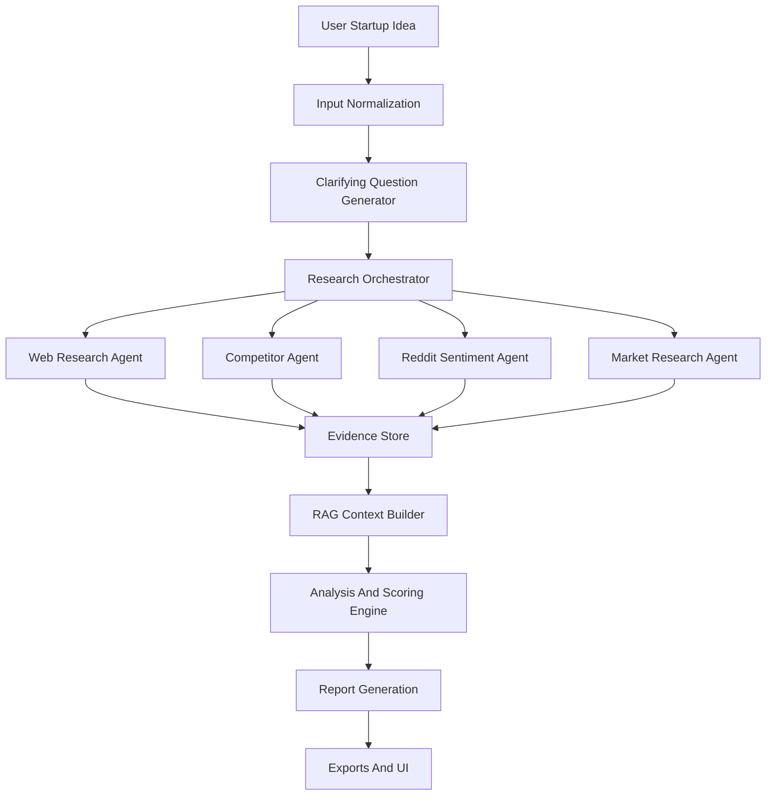
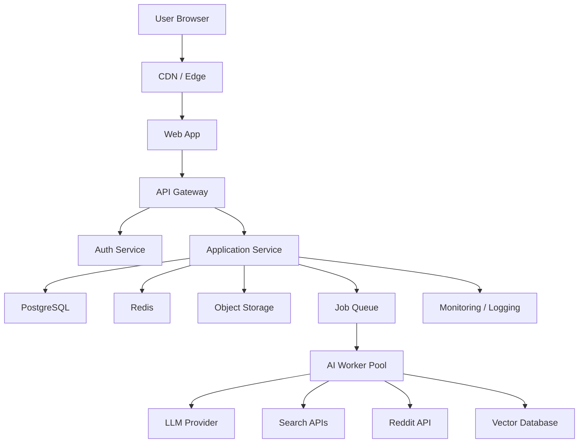

# Product Requirements Document: AI Startup Copilot

## 1. Document Control

| Field | Details |
| --- | --- |
| Product | AI Startup Copilot |
| Document Type | Product Requirements Document |
| Version | 1.0 |
| Date | June 3, 2026 |
| Owner | Product Management |
| Target Audience | Founders, startup teams, accelerators, venture studios, startup consultants |
| Primary Goal | Help entrepreneurs validate startup ideas using AI, structured workflows, and external data sources |

## 2. Executive Summary

AI Startup Copilot is an AI SaaS platform that helps entrepreneurs evaluate, refine, and prepare startup ideas for execution or fundraising. The platform combines large language models, agentic research workflows, external data integrations, and structured business frameworks to generate startup validation reports, market research, competitor analysis, Reddit sentiment analysis, SWOT analysis, MVP plans, revenue models, investor readiness scores, financial projections, customer personas, go-to-market plans, and pitch decks.

The product is designed to reduce the time, cost, and ambiguity involved in early-stage startup validation. Instead of relying on scattered research, generic AI chat prompts, and manual slide creation, founders can move through a guided workflow that turns a raw idea into a structured evidence-backed startup dossier.

## 3. Problem Statement

Early-stage entrepreneurs often struggle to validate startup ideas because the process requires multiple skills and fragmented data sources:

- Market sizing and trend research
- Competitor discovery and comparison
- Customer pain-point analysis
- Sentiment mining from public communities
- Business model design
- Financial modeling
- MVP prioritization
- Investor narrative development

Most founders either skip these steps, perform them inconsistently, or rely on generic AI outputs without traceable sources. This leads to weak validation, poor positioning, shallow investor materials, and wasted product-building effort.

## 4. Goals And Success Metrics

### Product Goals

1. Enable users to validate a startup idea in under 30 minutes.
2. Generate source-backed startup research artifacts.
3. Help founders identify market, competitive, financial, and execution risks.
4. Convert research outputs into practical startup assets, including MVP plans, GTM plans, financial projections, and pitch decks.
5. Provide a repeatable validation workflow for founders, accelerators, and venture studios.

### Business Goals

1. Acquire early-stage founders through self-serve SaaS onboarding.
2. Monetize through subscriptions, pay-per-report credits, and accelerator/enterprise plans.
3. Build durable differentiation through proprietary startup scoring, structured research pipelines, and user-specific knowledge memory.

### Success Metrics

| Metric | Target |
| --- | --- |
| Time to first validation report | Less than 10 minutes |
| Completed validation workflow rate | Greater than 60% |
| Pitch deck generation conversion | Greater than 35% of completed validations |
| Weekly active workspaces | Greater than 40% of active accounts |
| Report regeneration rate | Less than 20% for quality-related reasons |
| User-reported output usefulness | Greater than 4.3 out of 5 |
| Trial-to-paid conversion | Greater than 8% self-serve |
| Enterprise pilot activation | At least 3 active accelerator or venture studio pilots |

## 5. Target Users

### Primary Personas

| Persona | Description | Needs |
| --- | --- | --- |
| First-time founder | Has an idea but limited startup experience | Guided validation, simple explanations, actionable next steps |
| Repeat founder | Has experience and wants speed | High-quality research, strong competitive and market signals |
| Accelerator mentor | Evaluates many startups | Standardized reports, scoring, comparison across teams |
| Venture studio operator | Tests multiple startup concepts | Batch idea validation, market maps, MVP and GTM planning |
| Startup consultant | Produces strategy artifacts for clients | Exportable reports, decks, financial models, branded output |

### User Skill Levels

- Beginner: needs guided workflows and examples.
- Intermediate: needs editable outputs and decision support.
- Advanced: needs source transparency, customization, exports, and collaboration.

## 6. Product Scope

### In Scope For MVP

- Startup idea intake
- AI-generated validation report
- Market research summary
- Competitor analysis
- Reddit sentiment analysis
- SWOT analysis
- MVP feature plan
- Revenue model suggestions
- Investor readiness scoring
- Customer persona generation
- Go-to-market plan
- Financial projection template
- Pitch deck outline and export
- Project workspace with saved reports
- User authentication and subscription billing

### Out Of Scope For MVP

- Direct investor introductions
- Legal incorporation services
- Live fundraising marketplace
- Automated bank-account or payment-processor integrations
- Guaranteed market size accuracy
- Fully autonomous startup execution
- Real-time private financial data analysis

## 7. Key User Journeys

### Journey 1: Validate A Startup Idea

1. User creates a new startup project.
2. User enters idea, target audience, geography, industry, and known competitors.
3. System enriches idea with clarifying questions.
4. User confirms or edits assumptions.
5. AI agents research market, competitors, customer pain points, and sentiment.
6. System generates validation report.
7. User receives score, risks, opportunities, and next-step recommendations.

### Journey 2: Generate Investor Materials

1. User opens a validated startup project.
2. User selects "Investor Readiness."
3. System evaluates problem clarity, market size, competition, traction, business model, defensibility, team, and financial assumptions.
4. User receives investor readiness score and improvement checklist.
5. User generates pitch deck.
6. User edits slides and exports PDF/PPTX.

### Journey 3: Plan MVP And GTM

1. User selects "MVP Plan."
2. System generates core user problem, feature prioritization, development phases, success metrics, and validation experiments.
3. User selects preferred business model.
4. System generates GTM channels, messaging, launch sequence, and early customer acquisition plan.

## 8. User Stories

### Startup Idea Validation

- As a founder, I want to enter a raw startup idea so that I can understand whether it is worth pursuing.
- As a founder, I want the system to ask clarifying questions so that the validation is based on realistic assumptions.
- As a founder, I want a validation score so that I can quickly compare multiple ideas.
- As a founder, I want the system to explain risks so that I know what to test next.

### Competitor Analysis

- As a founder, I want to discover competitors so that I understand the existing market.
- As a founder, I want competitors compared by positioning, pricing, features, audience, and funding signals so that I can identify differentiation.
- As a venture studio operator, I want competitor maps across multiple ideas so that I can prioritize opportunities.

### Market Research

- As a founder, I want market size, growth trends, and customer segments so that I can judge opportunity quality.
- As an accelerator mentor, I want sources attached to market claims so that I can evaluate credibility.

### Reddit Sentiment Analysis

- As a founder, I want to analyze Reddit discussions so that I can detect authentic customer pain points.
- As a founder, I want sentiment, recurring complaints, desired alternatives, and willingness-to-pay signals so that I can shape the product.

### SWOT Analysis

- As a founder, I want a SWOT analysis so that I can understand internal and external strategic factors.

### MVP Generation

- As a founder, I want an MVP feature list so that I know what to build first.
- As a technical cofounder, I want features prioritized by impact and effort so that I can plan engineering work.

### Revenue Model Generation

- As a founder, I want revenue model options so that I can choose a monetization path.
- As a founder, I want pricing hypotheses so that I can test willingness to pay.

### Investor Readiness Scoring

- As a founder, I want an investor readiness score so that I know whether my startup is fundable.
- As a founder, I want a checklist of weak areas so that I can improve before pitching.

### Startup Similarity Detection

- As a founder, I want to know whether similar startups already exist so that I avoid building a duplicate idea without differentiation.

### Pitch Deck Generation

- As a founder, I want to generate a pitch deck so that I can present my idea professionally.
- As a consultant, I want deck exports so that I can share client-ready materials.

### Financial Projections

- As a founder, I want revenue, cost, and runway projections so that I can estimate business viability.

### Customer Persona Generation

- As a founder, I want customer personas so that I can design messaging and product features around real user needs.

### Go-To-Market Planning

- As a founder, I want a GTM plan so that I know how to acquire early customers.

## 9. Functional Requirements

### 9.1 Authentication And Account Management

| ID | Requirement | Priority |
| --- | --- | --- |
| FR-001 | Users can sign up with email/password and OAuth providers. | P0 |
| FR-002 | Users can create and manage organization workspaces. | P0 |
| FR-003 | Users can invite collaborators to a workspace. | P1 |
| FR-004 | Users can manage subscription plan, billing, and usage credits. | P0 |
| FR-005 | Role-based permissions must support owner, admin, editor, and viewer. | P1 |

### 9.2 Startup Project Management

| ID | Requirement | Priority |
| --- | --- | --- |
| FR-010 | Users can create, edit, archive, and duplicate startup projects. | P0 |
| FR-011 | Each project stores idea description, industry, geography, audience, assumptions, and outputs. | P0 |
| FR-012 | Users can compare multiple startup ideas in a workspace. | P1 |
| FR-013 | Users can regenerate individual report sections. | P0 |
| FR-014 | Users can view version history for generated outputs. | P1 |

### 9.3 Idea Validation

| ID | Requirement | Priority |
| --- | --- | --- |
| FR-020 | System generates a validation score from 0 to 100. | P0 |
| FR-021 | Score must include component scores for problem severity, market opportunity, competition, monetization, feasibility, and timing. | P0 |
| FR-022 | System identifies key assumptions and validation experiments. | P0 |
| FR-023 | System provides confidence level based on source quality and data coverage. | P0 |

### 9.4 Competitor Analysis

| ID | Requirement | Priority |
| --- | --- | --- |
| FR-030 | System discovers direct, indirect, and adjacent competitors. | P0 |
| FR-031 | System compares competitors by features, positioning, audience, pricing, geography, funding, and traction signals. | P0 |
| FR-032 | System generates a differentiation map. | P1 |
| FR-033 | Users can manually add or remove competitors. | P0 |

### 9.5 Market Research

| ID | Requirement | Priority |
| --- | --- | --- |
| FR-040 | System generates market overview, target segments, trends, and barriers. | P0 |
| FR-041 | System estimates TAM, SAM, and SOM where sufficient data exists. | P1 |
| FR-042 | System cites external sources for major claims. | P0 |
| FR-043 | System labels unsupported claims as assumptions. | P0 |

### 9.6 Reddit Sentiment Analysis

| ID | Requirement | Priority |
| --- | --- | --- |
| FR-050 | System searches relevant subreddits based on startup idea and customer segment. | P0 |
| FR-051 | System extracts common pain points, objections, alternatives, and buying signals. | P0 |
| FR-052 | System provides sentiment score by topic. | P1 |
| FR-053 | System links to source discussions where allowed by platform terms. | P0 |
| FR-054 | System must respect Reddit API rate limits and data policies. | P0 |

### 9.7 SWOT Analysis

| ID | Requirement | Priority |
| --- | --- | --- |
| FR-060 | System generates strengths, weaknesses, opportunities, and threats. | P0 |
| FR-061 | Each SWOT item includes rationale and recommended action. | P1 |

### 9.8 MVP Generation

| ID | Requirement | Priority |
| --- | --- | --- |
| FR-070 | System generates MVP feature list. | P0 |
| FR-071 | Features are prioritized by impact, effort, risk reduction, and dependency. | P0 |
| FR-072 | System generates release phases and success metrics. | P0 |
| FR-073 | System generates validation experiments before build. | P0 |

### 9.9 Revenue Model Generation

| ID | Requirement | Priority |
| --- | --- | --- |
| FR-080 | System generates revenue model options such as SaaS, marketplace, usage-based, subscription, transaction fee, ads, licensing, and services. | P0 |
| FR-081 | System recommends primary and secondary monetization models. | P0 |
| FR-082 | System generates pricing hypotheses and risks. | P1 |

### 9.10 Investor Readiness Scoring

| ID | Requirement | Priority |
| --- | --- | --- |
| FR-090 | System generates investor readiness score from 0 to 100. | P0 |
| FR-091 | Score includes problem, market, solution, traction, team, competition, business model, financials, and narrative quality. | P0 |
| FR-092 | System provides stage-specific recommendations for pre-seed, seed, and Series A. | P1 |

### 9.11 Startup Similarity Detection

| ID | Requirement | Priority |
| --- | --- | --- |
| FR-100 | System detects similar startups from web, databases, and internal project corpus. | P0 |
| FR-101 | System calculates similarity score using semantic embeddings and metadata. | P0 |
| FR-102 | System highlights similarities and differentiation gaps. | P0 |

### 9.12 Pitch Deck Generation

| ID | Requirement | Priority |
| --- | --- | --- |
| FR-110 | System generates pitch deck outline. | P0 |
| FR-111 | System generates editable slide content. | P0 |
| FR-112 | System supports export to PDF and PPTX. | P1 |
| FR-113 | Deck must include problem, solution, market, product, business model, traction, GTM, competition, team, financials, and ask. | P0 |

### 9.13 Financial Projections

| ID | Requirement | Priority |
| --- | --- | --- |
| FR-120 | System generates three-year financial projections. | P0 |
| FR-121 | Projections include revenue, COGS, operating expenses, headcount, runway, gross margin, and break-even estimate. | P0 |
| FR-122 | Users can edit assumptions. | P0 |
| FR-123 | System generates conservative, base, and aggressive scenarios. | P1 |

### 9.14 Customer Persona Generation

| ID | Requirement | Priority |
| --- | --- | --- |
| FR-130 | System generates primary and secondary customer personas. | P0 |
| FR-131 | Personas include goals, pain points, triggers, objections, buying process, channels, and messaging. | P0 |
| FR-132 | Personas must be grounded in market and sentiment findings where possible. | P0 |

### 9.15 Go-To-Market Planning

| ID | Requirement | Priority |
| --- | --- | --- |
| FR-140 | System generates GTM strategy by customer segment. | P0 |
| FR-141 | GTM plan includes channels, messaging, launch sequence, funnel metrics, and experiments. | P0 |
| FR-142 | System recommends acquisition channels based on audience and business model. | P0 |

### 9.16 Exporting And Collaboration

| ID | Requirement | Priority |
| --- | --- | --- |
| FR-150 | Users can export reports to PDF, DOCX, and Markdown. | P1 |
| FR-151 | Users can export pitch decks to PDF and PPTX. | P1 |
| FR-152 | Users can comment on report sections. | P2 |
| FR-153 | Users can share read-only links. | P1 |

## 10. Non-Functional Requirements

| Category | Requirement |
| --- | --- |
| Performance | Initial project dashboard loads in less than 2 seconds at p95. |
| AI Latency | Standard validation report completes in less than 8 minutes at p90. |
| Availability | Platform availability target is 99.9% monthly uptime for paid plans. |
| Reliability | Long-running AI jobs must be resumable and retryable. |
| Data Freshness | External research should indicate retrieval timestamp and source date where available. |
| Explainability | Scores must include rationale and component breakdowns. |
| Auditability | Generated reports must store prompt version, model, sources, and generation timestamp. |
| Accessibility | Web application must meet WCAG 2.1 AA standards. |
| Localization | Architecture should support future multi-language output. |
| Browser Support | Latest two versions of Chrome, Edge, Firefox, and Safari. |
| Maintainability | Services must use typed contracts, automated tests, and documented APIs. |
| Portability | Core system should support deployment on AWS, GCP, or Azure with minimal vendor lock-in. |

## 11. Database Schema

### Core Entities

```sql
CREATE TABLE users (
  id UUID PRIMARY KEY,
  email VARCHAR(255) UNIQUE NOT NULL,
  name VARCHAR(255),
  password_hash TEXT,
  auth_provider VARCHAR(50),
  created_at TIMESTAMP NOT NULL,
  updated_at TIMESTAMP NOT NULL
);

CREATE TABLE organizations (
  id UUID PRIMARY KEY,
  name VARCHAR(255) NOT NULL,
  plan VARCHAR(50) NOT NULL,
  billing_customer_id VARCHAR(255),
  created_at TIMESTAMP NOT NULL,
  updated_at TIMESTAMP NOT NULL
);

CREATE TABLE organization_members (
  id UUID PRIMARY KEY,
  organization_id UUID REFERENCES organizations(id),
  user_id UUID REFERENCES users(id),
  role VARCHAR(50) NOT NULL,
  created_at TIMESTAMP NOT NULL
);

CREATE TABLE startup_projects (
  id UUID PRIMARY KEY,
  organization_id UUID REFERENCES organizations(id),
  created_by UUID REFERENCES users(id),
  name VARCHAR(255) NOT NULL,
  idea_description TEXT NOT NULL,
  industry VARCHAR(255),
  geography VARCHAR(255),
  target_audience TEXT,
  stage VARCHAR(50),
  status VARCHAR(50) NOT NULL,
  created_at TIMESTAMP NOT NULL,
  updated_at TIMESTAMP NOT NULL
);

CREATE TABLE project_assumptions (
  id UUID PRIMARY KEY,
  project_id UUID REFERENCES startup_projects(id),
  assumption_type VARCHAR(100),
  description TEXT NOT NULL,
  confidence_score DECIMAL(5,2),
  validation_status VARCHAR(50),
  created_at TIMESTAMP NOT NULL
);

CREATE TABLE ai_reports (
  id UUID PRIMARY KEY,
  project_id UUID REFERENCES startup_projects(id),
  report_type VARCHAR(100) NOT NULL,
  status VARCHAR(50) NOT NULL,
  content_json JSONB NOT NULL,
  summary TEXT,
  score DECIMAL(5,2),
  confidence_score DECIMAL(5,2),
  model_name VARCHAR(100),
  prompt_version VARCHAR(50),
  created_at TIMESTAMP NOT NULL,
  updated_at TIMESTAMP NOT NULL
);

CREATE TABLE report_sources (
  id UUID PRIMARY KEY,
  report_id UUID REFERENCES ai_reports(id),
  source_type VARCHAR(100),
  title TEXT,
  url TEXT,
  publisher VARCHAR(255),
  published_at TIMESTAMP,
  retrieved_at TIMESTAMP NOT NULL,
  relevance_score DECIMAL(5,2)
);

CREATE TABLE competitors (
  id UUID PRIMARY KEY,
  project_id UUID REFERENCES startup_projects(id),
  name VARCHAR(255) NOT NULL,
  website TEXT,
  competitor_type VARCHAR(50),
  positioning TEXT,
  pricing_summary TEXT,
  feature_summary TEXT,
  funding_summary TEXT,
  similarity_score DECIMAL(5,2),
  created_at TIMESTAMP NOT NULL
);

CREATE TABLE reddit_insights (
  id UUID PRIMARY KEY,
  project_id UUID REFERENCES startup_projects(id),
  subreddit VARCHAR(255),
  topic VARCHAR(255),
  sentiment_score DECIMAL(5,2),
  pain_points JSONB,
  objections JSONB,
  source_urls JSONB,
  created_at TIMESTAMP NOT NULL
);

CREATE TABLE financial_models (
  id UUID PRIMARY KEY,
  project_id UUID REFERENCES startup_projects(id),
  scenario VARCHAR(50) NOT NULL,
  assumptions_json JSONB NOT NULL,
  projections_json JSONB NOT NULL,
  created_at TIMESTAMP NOT NULL,
  updated_at TIMESTAMP NOT NULL
);

CREATE TABLE pitch_decks (
  id UUID PRIMARY KEY,
  project_id UUID REFERENCES startup_projects(id),
  title VARCHAR(255),
  slides_json JSONB NOT NULL,
  export_url TEXT,
  created_at TIMESTAMP NOT NULL,
  updated_at TIMESTAMP NOT NULL
);

CREATE TABLE ai_jobs (
  id UUID PRIMARY KEY,
  project_id UUID REFERENCES startup_projects(id),
  job_type VARCHAR(100) NOT NULL,
  status VARCHAR(50) NOT NULL,
  input_json JSONB,
  output_json JSONB,
  error_message TEXT,
  started_at TIMESTAMP,
  completed_at TIMESTAMP,
  created_at TIMESTAMP NOT NULL
);

CREATE TABLE embeddings (
  id UUID PRIMARY KEY,
  entity_type VARCHAR(100) NOT NULL,
  entity_id UUID NOT NULL,
  embedding VECTOR(1536),
  metadata JSONB,
  created_at TIMESTAMP NOT NULL
);
```

### Storage Notes

- PostgreSQL should be the primary relational database.
- pgvector or a managed vector database should be used for similarity detection.
- Object storage should store generated PDFs, PPTX files, charts, and large exports.
- Redis should be used for job queues, rate limiting, and temporary cache.

## 12. API Design

### API Principles

- REST for core product APIs.
- Async job model for long-running AI workflows.
- Webhooks or server-sent events for job progress updates.
- Versioned APIs under `/api/v1`.
- Strict authorization on organization and project boundaries.

### Representative Endpoints

#### Authentication

```http
POST /api/v1/auth/signup
POST /api/v1/auth/login
POST /api/v1/auth/logout
GET  /api/v1/auth/me
```

#### Organizations

```http
GET    /api/v1/organizations
POST   /api/v1/organizations
GET    /api/v1/organizations/{organizationId}
PATCH  /api/v1/organizations/{organizationId}
POST   /api/v1/organizations/{organizationId}/members
```

#### Startup Projects

```http
GET    /api/v1/projects
POST   /api/v1/projects
GET    /api/v1/projects/{projectId}
PATCH  /api/v1/projects/{projectId}
DELETE /api/v1/projects/{projectId}
POST   /api/v1/projects/{projectId}/duplicate
```

#### AI Reports

```http
POST /api/v1/projects/{projectId}/reports/validation
POST /api/v1/projects/{projectId}/reports/market-research
POST /api/v1/projects/{projectId}/reports/competitors
POST /api/v1/projects/{projectId}/reports/reddit-sentiment
POST /api/v1/projects/{projectId}/reports/swot
POST /api/v1/projects/{projectId}/reports/mvp
POST /api/v1/projects/{projectId}/reports/revenue-model
POST /api/v1/projects/{projectId}/reports/investor-readiness
POST /api/v1/projects/{projectId}/reports/personas
POST /api/v1/projects/{projectId}/reports/gtm
GET  /api/v1/projects/{projectId}/reports
GET  /api/v1/reports/{reportId}
```

#### Jobs

```http
GET  /api/v1/jobs/{jobId}
POST /api/v1/jobs/{jobId}/cancel
GET  /api/v1/jobs/{jobId}/events
```

#### Pitch Decks And Exports

```http
POST /api/v1/projects/{projectId}/pitch-deck
GET  /api/v1/pitch-decks/{deckId}
PATCH /api/v1/pitch-decks/{deckId}
POST /api/v1/pitch-decks/{deckId}/export
POST /api/v1/reports/{reportId}/export
```

### Example Request

```json
{
  "ideaDescription": "An AI assistant that helps solo founders validate SaaS ideas using Reddit, competitor research, and financial models.",
  "industry": "B2B SaaS",
  "geography": "United States",
  "targetAudience": "Solo founders and early-stage startup teams",
  "knownCompetitors": ["ValidatorAI", "ChatGPT", "Notion AI"],
  "stage": "idea"
}
```

### Example Job Response

```json
{
  "jobId": "0e9c9e2d-71c8-4b01-b3a7-d394b51f6c54",
  "status": "queued",
  "estimatedCompletionSeconds": 240
}
```

## 13. AI Architecture

### AI System Overview

The AI layer should combine orchestration, retrieval, tool use, scoring models, and generation pipelines.



### Model Usage

| Task | Model Type |
| --- | --- |
| Clarifying questions | Fast reasoning-capable LLM |
| Research synthesis | Strong reasoning LLM with citation support |
| Sentiment classification | LLM or fine-tuned classifier |
| Similarity detection | Embedding model |
| Financial projections | Deterministic calculation engine plus LLM explanation |
| Pitch deck generation | LLM plus slide template engine |
| Quality checks | LLM evaluator and rule-based validation |

### Retrieval-Augmented Generation

RAG should be used for:

- External market research
- Competitor details
- Reddit insight summaries
- Internal project memory
- User-uploaded documents
- Historical generated reports

RAG responses must:

- Prefer recent and authoritative sources.
- Include source references.
- Separate sourced facts from AI-generated assumptions.
- Store source metadata for auditability.

### Scoring Framework

Startup validation score:

| Component | Weight |
| --- | --- |
| Problem severity | 20% |
| Target customer clarity | 15% |
| Market opportunity | 20% |
| Competitive differentiation | 15% |
| Monetization potential | 10% |
| MVP feasibility | 10% |
| Timing and trend alignment | 10% |

Investor readiness score:

| Component | Weight |
| --- | --- |
| Problem and urgency | 15% |
| Market size | 15% |
| Solution clarity | 10% |
| Differentiation | 10% |
| Business model | 10% |
| Traction or validation evidence | 15% |
| Team strength | 10% |
| Financial story | 10% |
| Pitch narrative | 5% |

## 14. Agent Architecture

### Agent Roles

| Agent | Responsibility |
| --- | --- |
| Orchestrator Agent | Breaks user request into tasks, assigns agents, merges results |
| Clarification Agent | Identifies missing business assumptions and asks follow-up questions |
| Market Research Agent | Finds trends, market size, segment definitions, and growth drivers |
| Competitor Agent | Discovers and compares direct and indirect competitors |
| Reddit Sentiment Agent | Searches discussions and extracts sentiment, pain points, and demand signals |
| SWOT Agent | Converts research findings into strategic SWOT |
| Similarity Agent | Uses embeddings and external search to detect similar startups |
| MVP Agent | Generates feature roadmap, experiments, and development phases |
| Revenue Agent | Generates monetization models and pricing hypotheses |
| Financial Agent | Builds projections using editable assumptions and deterministic formulas |
| Investor Agent | Scores investor readiness and creates fundraising recommendations |
| Pitch Deck Agent | Converts reports into investor-ready slide structure and content |
| Quality Agent | Checks factual grounding, source coverage, consistency, and hallucination risk |

### Agent Guardrails

- Agents must return structured JSON outputs.
- Agents must include confidence scores.
- Claims requiring evidence must include source references or be marked as assumptions.
- Agents must not fabricate metrics, funding, customer quotes, or source URLs.
- Quality Agent must block or flag low-confidence outputs.
- Financial Agent must use deterministic formulas for calculations.

### Agent Workflow

1. Orchestrator receives project input.
2. Clarification Agent identifies missing fields.
3. Research agents collect external and internal evidence.
4. RAG Context Builder prepares source-grounded context.
5. Specialist agents generate structured analysis.
6. Quality Agent evaluates factuality, completeness, and consistency.
7. Orchestrator assembles final report.
8. UI renders report modules and recommended next actions.

## 15. Deployment Architecture



### Recommended Stack

| Layer | Recommendation |
| --- | --- |
| Frontend | Next.js or React |
| Backend | Node.js/NestJS, Python/FastAPI, or equivalent service framework |
| Database | PostgreSQL |
| Vector Search | pgvector, Pinecone, Weaviate, or managed equivalent |
| Queue | Redis Queue, BullMQ, Temporal, or Celery |
| Cache | Redis |
| Object Storage | S3-compatible storage |
| Authentication | Auth0, Clerk, Cognito, or custom OAuth/JWT |
| Payments | Stripe |
| Infrastructure | Kubernetes, ECS, Cloud Run, or managed containers |
| Observability | OpenTelemetry, Datadog, Grafana, Sentry |

## 16. Security Requirements

### Authentication And Authorization

- Enforce secure authentication with strong password policies and OAuth support.
- Support MFA for enterprise plans.
- Use short-lived access tokens and refresh tokens.
- Enforce organization-level and project-level access control.
- Apply least-privilege permissions to internal services.

### Data Protection

- Encrypt data in transit using TLS 1.2 or higher.
- Encrypt sensitive data at rest.
- Store API keys and secrets in a managed secrets vault.
- Separate tenant data logically by organization ID.
- Avoid sending unnecessary personal data to third-party AI providers.
- Support data deletion requests.

### AI Security

- Add prompt injection detection for user inputs and external retrieved content.
- Strip or isolate untrusted instructions from web pages and Reddit content.
- Use tool allowlists for AI agents.
- Log model inputs and outputs with sensitive-data redaction.
- Prevent agents from executing arbitrary code or unauthorized network calls.
- Apply content filters to generated outputs.

### Compliance Considerations

- GDPR readiness for EU users.
- SOC 2 Type II readiness for enterprise customers.
- Vendor risk assessment for LLM, search, Reddit, billing, and analytics providers.
- Data processing agreements for enterprise plans.

## 17. Scalability Considerations

- Use async job queues for long-running AI tasks.
- Horizontally scale AI workers independently from API servers.
- Cache repeated external research queries where licensing allows.
- Rate-limit expensive AI actions by plan and workspace.
- Use streaming progress updates for long-running workflows.
- Shard or partition high-volume job and event tables if needed.
- Use vector index optimization for startup similarity search.
- Precompute common market and competitor embeddings.
- Implement graceful degradation when external data providers are unavailable.
- Support batch processing for accelerator and venture studio accounts.

## 18. Monitoring Requirements

### Product Analytics

- Signup conversion
- Activation rate
- Time to first project
- Time to first completed report
- Report completion rate
- Regeneration frequency
- Export frequency
- Feature usage by module
- Trial-to-paid conversion

### System Metrics

- API latency p50, p90, p95, p99
- Error rate by endpoint
- Job queue depth
- Job success and failure rate
- AI worker utilization
- Database query latency
- Cache hit rate
- External API latency and failure rate

### AI Quality Metrics

- Source coverage per report
- Unsupported claim rate
- User thumbs-up/thumbs-down
- Report edit distance after generation
- Hallucination flags from Quality Agent
- Average confidence score by report type
- Model cost per completed project

### Alerting

- API error rate exceeds threshold.
- AI job failure rate exceeds threshold.
- Queue depth exceeds processing capacity.
- External provider outage or rate-limit spike.
- Database CPU, memory, or connection pool saturation.
- Unusual usage or suspected abuse.

## 19. MVP Release Plan

### Phase 1: Private Alpha

Timeline: 6-8 weeks

Deliverables:

- User authentication
- Project creation
- Basic idea validation report
- Competitor analysis
- Market research
- SWOT analysis
- MVP plan
- Basic report export

Success Criteria:

- 20-50 test users complete at least one validation.
- Average usefulness score greater than 4.0 out of 5.
- Less than 15% critical AI output failure rate.

### Phase 2: Public Beta

Timeline: 8-12 weeks

Deliverables:

- Reddit sentiment analysis
- Revenue model generation
- Investor readiness scoring
- Customer personas
- GTM planning
- Financial projection assumptions
- Usage-based billing

Success Criteria:

- 1,000 registered users.
- 8% trial-to-paid conversion.
- Validation report completion rate greater than 50%.

### Phase 3: Commercial Launch

Timeline: 12-16 weeks

Deliverables:

- Pitch deck generation
- PDF and PPTX export
- Startup similarity detection
- Collaboration
- Enterprise workspace controls
- Advanced monitoring and quality dashboards

Success Criteria:

- 100 paying customers.
- 3 enterprise pilots.
- 99.9% uptime for paid users.

## 20. Risks And Mitigations

| Risk | Impact | Mitigation |
| --- | --- | --- |
| AI hallucination | Users may make poor decisions | Source grounding, confidence scores, Quality Agent, unsupported-claim labels |
| Poor external data quality | Weak research outputs | Multi-source retrieval, source ranking, user-editable assumptions |
| High model cost | Margin pressure | Caching, model routing, usage limits, batch processing |
| Reddit API limitations | Sentiment feature reliability risk | Respect API policies, add fallback community sources where permitted |
| Generic outputs | Low differentiation | Structured scoring, templates, domain-specific agents, user context memory |
| User overtrust | Bad business decisions | Clear disclaimers, assumptions, confidence indicators, recommended validation experiments |
| Competitive market | SaaS differentiation challenge | Proprietary workflow, startup similarity corpus, accelerator integrations |

## 21. Open Questions

1. Which geographies should be supported at launch?
2. Should the MVP support only SaaS ideas or all startup categories?
3. Which external data providers are approved for market and competitor research?
4. Should generated pitch decks use fixed templates or a custom design editor?
5. What level of source visibility is required for free versus paid users?
6. Should accelerator accounts support bulk upload of startup ideas?
7. How much user data should be retained for personalization?
8. What disclaimers are required for financial projections and investor readiness scoring?

## 22. Acceptance Criteria

The MVP is considered ready for private alpha when:

- A user can sign up, create a workspace, and create a startup project.
- A user can submit a startup idea and receive a validation report.
- The validation report includes score, rationale, assumptions, market research, competitors, SWOT, and MVP recommendations.
- Major factual claims include sources or assumption labels.
- Long-running jobs show status and recover from transient failures.
- Generated reports are saved and retrievable.
- Basic export works.
- Admins can monitor job failures, AI costs, and usage.
- Security review finds no critical authentication, authorization, or data exposure issues.

## 23. Appendix: Report Modules

### Startup Validation Report Structure

1. Executive summary
2. Startup idea interpretation
3. Target customer
4. Problem severity
5. Market opportunity
6. Competitor landscape
7. Differentiation opportunities
8. Reddit and community sentiment
9. SWOT analysis
10. MVP recommendation
11. Revenue model recommendation
12. Financial assumptions
13. Investor readiness
14. Risks and unknowns
15. Validation experiments
16. Recommended next steps

### Pitch Deck Structure

1. Title
2. Problem
3. Target customer
4. Solution
5. Product
6. Market opportunity
7. Business model
8. Competition
9. Go-to-market
10. Traction or validation evidence
11. Financial projections
12. Team
13. Fundraising ask
14. Closing vision

