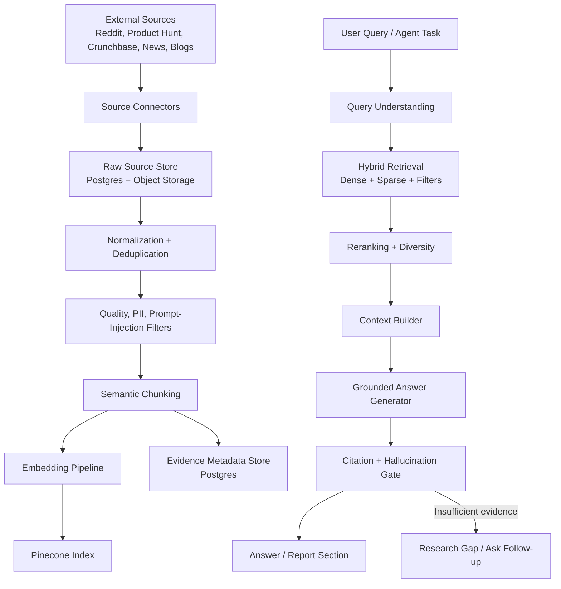

# AI Startup Copilot: Production RAG Architecture

## 1. Objective

Build a source-grounded RAG system that continuously ingests startup ecosystem signals from Reddit, Product Hunt, Crunchbase, startup news, and blogs, then supports evidence-backed idea validation, competitor analysis, market research, and report generation.

The system must optimize for:

- Freshness for fast-moving startup signals.
- Strong citation coverage for every factual claim.
- Tenant isolation across organizations and projects.
- Low hallucination rate through retrieval, evidence gating, and answer verification.
- Reproducible research workflows for generated reports.

## 2. High-Level Architecture



## 3. Data Source Strategy

| Source | Use Case | Ingestion Method | Freshness Target | Risks |
| --- | --- | --- | --- | --- |
| Reddit | Customer pain points, objections, sentiment, alternatives | Official API or approved data provider | 6-24 hours | Anecdotal bias, PII, toxicity, sarcasm |
| Product Hunt | Emerging competitors, launch traction, product positioning | API/RSS/scraper with policy compliance | 12-24 hours | Launch hype, sparse long-term traction |
| Crunchbase | Company profiles, funding, investors, categories | Licensed API | 24-72 hours | Paid access, stale funding metadata |
| Startup News | Trends, funding events, regulation, market shifts | RSS/news API/search provider | 1-6 hours | Duplicated syndicated articles |
| Blogs | Founder insights, technical trends, product comparisons | RSS/sitemap/crawler with robots compliance | 24-72 hours | Prompt injection, SEO spam |

## 4. Data Ingestion

### Connector Design

Each connector implements the same interface:

```python
class SourceConnector:
    source_type: str

    async def discover(self, job: IngestionJob) -> list[SourcePointer]:
        ...

    async def fetch(self, pointer: SourcePointer) -> RawDocument:
        ...

    async def normalize(self, raw: RawDocument) -> NormalizedDocument:
        ...
```

### Ingestion Flow

1. Scheduled worker creates source-specific ingestion jobs.
2. Connector discovers candidate URLs, posts, launches, companies, or feed items.
3. Raw payload is stored before transformation for auditability.
4. Normalizer extracts title, body, author/publisher, timestamps, canonical URL, source type, language, and source-specific metrics.
5. Deduplication runs on canonical URL, content hash, and semantic near-duplicate score.
6. Safety filters remove or flag PII, toxic content, malware links, and prompt-injection text.
7. Documents are chunked, embedded, indexed in Pinecone, and linked to Postgres metadata.

### Ingestion Job Types

- `scheduled_refresh`: recurring source crawl.
- `project_research`: targeted crawl for one startup idea.
- `competitor_refresh`: update known competitor profiles.
- `report_backfill`: retrieve deeper context for a report section.
- `source_reindex`: re-embed content after model or schema changes.

## 5. Canonical Data Model

Store canonical source metadata in Postgres and vector content in Pinecone.

```text
source_documents
  id
  organization_id nullable
  project_id nullable
  source_type
  canonical_url
  title
  publisher
  author_hash
  published_at
  retrieved_at
  language
  credibility_score
  freshness_score
  raw_content_hash
  normalized_content_hash
  status

source_chunks
  id
  document_id
  chunk_index
  text
  token_count
  section_title
  start_char
  end_char
  embedding_model
  pinecone_vector_id
  metadata_json

citations
  id
  report_id
  claim_text
  source_document_id
  source_chunk_id
  quote_excerpt
  url
  generated_at
  verification_status
```

## 6. Chunking Strategy

Use source-aware semantic chunking instead of one fixed character window.

### Default Chunk Policy

- Target: 450-800 tokens per chunk.
- Overlap: 80-120 tokens.
- Preserve headings, list boundaries, and paragraphs.
- Never split URLs, table rows, quoted snippets, or Product Hunt launch metadata.
- Add neighboring chunk references for reconstruction.

### Source-Specific Rules

| Source | Chunking Rule |
| --- | --- |
| Reddit | One post body per chunk when short; long posts split by paragraph. Comments grouped by thread branch and topic. |
| Product Hunt | Product summary, maker comment, launch metrics, and top comments are separate chunks. |
| Crunchbase | Company profile, funding events, investors, categories, and acquisitions are separate structured chunks. |
| Startup News | Chunk by article sections; keep headline and published date in every chunk metadata payload. |
| Blogs | Chunk by heading hierarchy; boilerplate, cookie notices, and nav text are removed before chunking. |

### Chunk Metadata

Each vector includes:

```json
{
  "organization_id": "string | null",
  "project_id": "string | null",
  "source_type": "reddit | product_hunt | crunchbase | startup_news | blog",
  "document_id": "uuid",
  "chunk_id": "uuid",
  "canonical_url": "string",
  "title": "string",
  "publisher": "string | null",
  "published_at": "iso-date | null",
  "retrieved_at": "iso-date",
  "credibility_score": 0.0,
  "freshness_score": 0.0,
  "topic_tags": ["string"],
  "company_names": ["string"],
  "market_categories": ["string"],
  "geography": ["string"],
  "pii_redacted": true,
  "prompt_injection_score": 0.0
}
```

## 7. Embedding Strategy

### Embedding Model Requirements

- High semantic recall across business, startup, technical, and consumer language.
- Stable vector dimensions for Pinecone index lifecycle.
- Good performance on short informal Reddit text and formal company/news text.
- Cost suitable for periodic reindexing.

### Embedding Pipeline

1. Normalize text: trim boilerplate, collapse whitespace, preserve original casing where useful.
2. Build embedding input with compact context prefix:

```text
Source: Product Hunt
Title: Example Product
Published: 2026-05-20
Content:
...
```

3. Batch embeddings by source and model.
4. Store `embedding_model`, `embedding_version`, and `content_hash`.
5. Skip embedding when `normalized_content_hash` is unchanged.
6. Reindex through versioned Pinecone namespaces when changing embedding models.

### Recommended Embedding Classes

- General source chunks: high-quality text embedding model.
- Structured company profiles: same model, but use field-aware text serialization.
- Query embeddings: same model as index.
- Optional sparse vectors: BM25/SPLADE-style sparse representation for exact company names, acronyms, and niche startup terms.

## 8. Pinecone Indexing

### Index Design

Use one production index with namespaces for environment and tenancy.

```text
Index: startup-copilot-rag
Metric: cosine
Vector type: dense
Namespaces:
  prod:global
  prod:org:{organization_id}
  prod:project:{project_id}
  staging:global
```

### Namespace Policy

- Public external content can live in `prod:global`.
- Organization-private documents live in `prod:org:{organization_id}`.
- Project-specific research snapshots live in `prod:project:{project_id}`.
- Retrieval may query multiple allowed namespaces, but never across unauthorized organizations.

### Vector ID Pattern

```text
{source_type}:{document_id}:{chunk_index}:{embedding_version}
```

### Metadata Filters

Common filters:

- `source_type`
- `published_at`
- `retrieved_at`
- `credibility_score >= threshold`
- `freshness_score >= threshold`
- `company_names contains competitor`
- `market_categories contains category`
- `geography contains target_region`
- `prompt_injection_score <= threshold`

## 9. Retrieval Strategy

### Query Understanding

Convert each user or agent task into:

```json
{
  "intent": "competitor_discovery | market_sizing | sentiment | trend | report_citation",
  "startup_summary": "string",
  "keywords": ["string"],
  "companies": ["string"],
  "industry": "string",
  "geography": "string",
  "source_preferences": ["reddit", "product_hunt", "crunchbase"],
  "freshness_required": "high | medium | low",
  "must_cite": true
}
```

### Retrieval Pipeline

1. Rewrite query into 3-5 focused subqueries.
2. Retrieve dense semantic matches from allowed Pinecone namespaces.
3. Retrieve sparse keyword matches for exact company/product terms.
4. Apply metadata filters for source type, freshness, geography, and credibility.
5. Merge and deduplicate by document and canonical URL.
6. Rerank top 50 candidates into top 8-15 chunks.
7. Enforce source diversity so one article or Reddit thread cannot dominate.
8. Build context with citation handles, not raw URLs alone.

### Retrieval Modes

| Mode | Used By | Behavior |
| --- | --- | --- |
| Broad scan | Market Research Agent | High diversity, multiple source types, freshness weighted. |
| Company lookup | Competitor Agent | Exact company/name matching plus Crunchbase/Product Hunt priority. |
| Sentiment mining | Reddit Agent | Reddit-only, thread-aware, topic-clustered retrieval. |
| Citation repair | Quality Gate | Retrieves evidence for unsupported claims. |
| Report grounding | Report Agent | Only approved evidence and verified source chunks. |

## 10. Citation Generation

### Citation Contract

Every factual claim in final outputs must be one of:

- `sourced_fact`: supported by one or more source chunks.
- `derived_insight`: derived from multiple cited facts.
- `assumption`: explicitly labeled as an assumption.
- `recommendation`: strategic advice based on cited facts and assumptions.

### Citation Format

Generated report sections should carry structured citations:

```json
{
  "claim": "Several competitors position themselves around AI workflow automation.",
  "claim_type": "sourced_fact",
  "citations": [
    {
      "source_id": "uuid",
      "chunk_id": "uuid",
      "title": "string",
      "publisher": "string",
      "url": "string",
      "published_at": "iso-date | null",
      "quote_excerpt": "short supporting excerpt"
    }
  ],
  "confidence_score": 0.82
}
```

### Citation Rules

- Do not cite a source unless the cited chunk directly supports the claim.
- Use at least two independent citations for high-impact claims where possible.
- Market-size claims require authoritative sources or must be labeled assumptions.
- Reddit citations support customer sentiment, not statistical market conclusions.
- Crunchbase citations support company/funding metadata, not customer demand.
- Citation excerpts should be short and used only to prove support.

## 11. Hallucination Prevention

### Before Generation

- Sanitize retrieved chunks for prompt injection.
- Exclude low-credibility and stale sources unless the task explicitly asks for historical context.
- Pass only citation-tagged context into the generator.
- Limit context to the minimum chunks needed for the answer.

### During Generation

The model must follow these rules:

```text
Use only the provided evidence context for factual claims.
If evidence is missing, say the evidence is insufficient.
Do not invent companies, URLs, funding amounts, market-size numbers, dates, or citations.
Label assumptions explicitly.
Return claim-level citations using the provided citation handles.
```

### After Generation

Run a verification gate:

1. Extract atomic claims.
2. Classify each claim as fact, derived insight, assumption, or recommendation.
3. Check every factual claim has a valid citation.
4. Verify cited chunks semantically support the claim.
5. Detect fabricated URLs or source IDs.
6. Check source freshness for time-sensitive claims.
7. Reject or repair unsupported claims.

### Refusal / Gap Behavior

If retrieval does not provide enough evidence:

- Say what is missing.
- Return a `research_gap` object.
- Suggest a targeted ingestion/search job.
- Do not fill the gap with model prior knowledge.

## 12. Backend Implementation Shape

Add RAG modules under the existing FastAPI clean architecture:

```text
backend/
  app/
    domain/
      rag_entities.py
      rag_repositories.py
      rag_services.py
    application/
      rag_dto.py
      use_cases/
        ingestion_use_cases.py
        retrieval_use_cases.py
        citation_use_cases.py
    infrastructure/
      connectors/
        reddit.py
        product_hunt.py
        crunchbase.py
        news.py
        blogs.py
      embeddings/
        client.py
        pipeline.py
      vectorstores/
        pinecone_client.py
        indexer.py
        retriever.py
      safety/
        pii.py
        prompt_injection.py
        source_quality.py
      chunking/
        semantic_chunker.py
        source_rules.py
    api/
      v1/
        ingestion.py
        retrieval.py
        citations.py
    workers/
      ingestion_jobs.py
      reindex_jobs.py
      retrieval_eval_jobs.py
```

## 13. API Surface

### Ingestion

```http
POST /api/v1/ingestion/jobs
GET /api/v1/ingestion/jobs/{job_id}
POST /api/v1/ingestion/jobs/{job_id}/cancel
```

### Retrieval

```http
POST /api/v1/retrieval/query
POST /api/v1/retrieval/research-gap
```

### Citations

```http
GET /api/v1/citations/{citation_id}
POST /api/v1/citations/verify
```

## 14. Observability

Track:

- Ingested documents per source.
- Chunk count and average token count.
- Embedding cost and latency.
- Pinecone upsert volume and failures.
- Retrieval precision feedback.
- Citation coverage.
- Unsupported claim rate.
- Source freshness distribution.
- Prompt-injection blocks.
- PII redaction count.

## 15. Evaluation Plan

### Offline Evaluation

- Golden startup idea set across industries.
- Known competitor recall benchmark.
- Market trend freshness benchmark.
- Reddit sentiment labeled sample.
- Citation support evaluation with human labels.
- Hallucination regression tests.

### Online Evaluation

- User edits to generated claims.
- Citation click-through rate.
- Regeneration rate.
- Report section acceptance rate.
- Human approval rejection rate.
- Retrieval feedback from agents.

### Quality Targets

| Metric | Target |
| --- | --- |
| Citation coverage for factual claims | >= 95% |
| Fabricated citation rate | 0% |
| Unsupported factual claim rate | <= 3% |
| Duplicate source rate in top context | <= 25% |
| PII leakage from Reddit | 0 known incidents |
| Fresh source coverage for news/trends | >= 80% within freshness window |

## 16. Implementation Plan

### Phase 1: Foundation

- Add RAG domain entities and DTOs.
- Add Postgres tables for source documents, chunks, ingestion jobs, retrieval traces, and citations.
- Add Pinecone settings to backend configuration.
- Implement Pinecone client wrapper with namespace enforcement.
- Implement source metadata repository.

### Phase 2: Ingestion MVP

- Implement startup news and blog RSS connectors first.
- Implement Reddit connector for targeted project research.
- Add normalizer, deduper, source quality scorer, PII redactor, and prompt-injection detector.
- Add semantic chunker with source-specific rules.
- Add embedding pipeline with content hash skipping.
- Add ingestion worker jobs.

### Phase 3: Pinecone Indexing

- Create `startup-copilot-rag` index.
- Add vector ID convention and metadata payloads.
- Implement batch upsert with retries.
- Add reindex job for embedding model changes.
- Add index health checks and stale vector cleanup.

### Phase 4: Retrieval

- Implement query understanding DTO.
- Add multi-query dense retrieval.
- Add source filters, freshness filters, and tenant namespace controls.
- Add reranking and diversity selection.
- Add context builder that emits citation handles.
- Store retrieval traces for evaluation.

### Phase 5: Citation And Verification

- Add claim extraction.
- Add citation validator.
- Add semantic support checker.
- Add hallucinated URL/source detector.
- Add report quality gate integration.
- Return research gaps when evidence is insufficient.

### Phase 6: Source Expansion

- Add Product Hunt connector.
- Add licensed Crunchbase connector.
- Add targeted competitor profile refresh.
- Add source-specific credibility scoring.
- Add scheduled refresh policies by source.

### Phase 7: Production Hardening

- Add rate limits and backoff per source.
- Add cost budgets per organization and project.
- Add retries, dead-letter queues, and idempotency keys.
- Add dashboards for ingestion health and unsupported claim rate.
- Add automated offline RAG evals in CI.
- Add human feedback loop for retrieval and citation quality.

## 17. Production Guardrails

- All external content is untrusted.
- All retrieval is namespace-filtered.
- All report facts require citations.
- All assumptions are labeled.
- All market-size numbers require authoritative support.
- All source connectors must respect API terms, rate limits, and robots policies.
- All generated reports keep retrieval traces for auditability.

